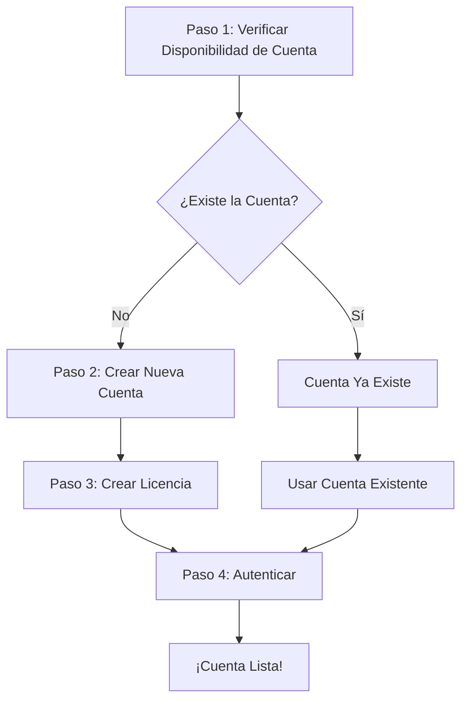

# Cómo Crear tu Cuenta Zelf

¡Bienvenido a la guía completa para crear una cuenta Zelf! Este tutorial te guiará a través de todo el proceso de configuración de tu identidad descentralizada en la plataforma Zelf.

## ¿Qué es Zelf?

Zelf es una **plataforma descentralizada sin permisos** que te permite crear identidades digitales seguras utilizando tecnología biométrica de vanguardia. A diferencia de los sistemas centralizados tradicionales, Zelf opera en una infraestructura descentralizada donde:

- **Ninguna autoridad central** controla tus datos
- **Tus datos biométricos** están encriptados y almacenados de forma segura
- **Pruebas de conocimiento cero** garantizan la privacidad mientras mantienen la seguridad
- **Almacenamiento IPFS** asegura que tus datos estén distribuidos y sean resilientes

## Por Qué Necesitamos tu Información

Podrías preguntarte por qué pedimos información detallada como biometría facial, contraseñas maestras y detalles personales. Esto es porque Zelf opera bajo principios de **tecnología sin permisos**:

### 🔐 **Seguridad Descentralizada**
- **Sin base de datos central** que pueda ser hackeada o comprometida
- **Verificación biométrica** asegura que solo tú puedas acceder a tu cuenta
- **Contraseña maestra** proporciona una capa adicional de seguridad
- **Pruebas de conocimiento cero** permiten verificación sin revelar datos sensibles

### 🌐 **Arquitectura Sin Permisos**
- **Sin guardianes** - cualquiera puede crear una cuenta
- **Sin proceso de aprobación** - el sistema valida automáticamente
- **Sin intermediarios** - interacciones directas entre pares
- **Resistente a la censura** - sin punto único de falla

### 🛡️ **Privacidad por Diseño**
- **Biometría facial** está encriptada y nunca se almacena en texto plano
- **Información personal** se almacena en IPFS (almacenamiento distribuido)
- **Pruebas de conocimiento cero** permiten verificación sin exposición de datos
- **Tú controlas tus datos** - no una entidad centralizada

## El Flujo Completo de Creación de Cuenta

Crear una cuenta Zelf involucra un **proceso de 4 pasos** que asegura seguridad, unicidad y configuración adecuada:



Caminemos a través de cada paso:

---

## Paso 1: Verificar Disponibilidad de Cuenta

Antes de crear una cuenta, necesitamos verificar si ya existe una cuenta con tu email o número de teléfono.

### Endpoint: `GET /api/clients`

**Propósito**: Verificar si ya existe una cuenta con tu email o número de teléfono.

**¿Por qué este paso?**: En un sistema sin permisos, necesitamos asegurar la unicidad de cuentas sin depender de una base de datos central. Esta verificación previene cuentas duplicadas y asegura la integridad de los datos.

### Ejemplo de Solicitud

```bash
# Verificar por email
curl -X GET "https://api.zelf.world/api/clients?email=tu.email@ejemplo.com" \
  -H "Content-Type: application/json"

# Verificar por teléfono
curl -X GET "https://api.zelf.world/api/clients?countryCode=%2B1&phone=5551234567" \
  -H "Content-Type: application/json"
```

### Respuestas Esperadas

**✅ Cuenta Disponible (Sin cuenta existente):**
```json
{
  "data": null
}
```

**❌ Cuenta Ya Existe:**
```json
{
  "data": {
    "id": "019983ff-99c0-78d0-ad25-0d7226626881",
    "publicData": {
      "accountEmail": "existente@ejemplo.com",
      "accountPhone": "5551234567",
      "accountCompany": "Empresa Existente",
      "accountType": "client_account"
    }
  }
}
```

**Si una cuenta existe**, puedes proceder directamente al [Paso 4: Autenticación](#paso-4-autenticar-tu-cuenta).

---

## Paso 2: Crear tu Cuenta

Si no existe ninguna cuenta, procede a crear una nueva.

### Endpoint: `POST /api/clients`

**Propósito**: Crear una nueva cuenta de cliente con verificación biométrica facial y contraseña maestra.

**Información Requerida**:
- **Detalles Personales**: Nombre, email, teléfono, empresa
- **Datos Biométricos**: Imagen facial (codificada en base64)
- **Seguridad**: Contraseña maestra para encriptación de cuenta

### Ejemplo de Solicitud

```bash
curl -X POST "https://api.zelf.world/api/clients" \
  -H "Content-Type: application/json" \
  -d '{
    "name": "Juan Pérez",
    "countryCode": "+1",
    "phone": "5551234567",
    "email": "juan.perez@ejemplo.com",
    "language": "es",
    "company": "Empresa Ejemplo",
    "faceBase64": "data:image/jpeg;base64,/9j/4AAQSkZJRgABAQAAAQ...",
    "masterPassword": "ContraseñaSegura123!"
  }'
```

### ¿Qué Sucede Durante la Creación de Cuenta?

1. **Procesamiento Biométrico**: Tu imagen facial se procesa para crear una firma biométrica única
2. **Encriptación**: Todos los datos sensibles se encriptan usando tu contraseña maestra
3. **Almacenamiento IPFS**: Los datos de la cuenta se almacenan en IPFS (Sistema de Archivos InterPlanetario)
4. **Generación de ZelfProof**: Se crea una prueba criptográfica para futuras autenticaciones
5. **Token JWT**: Recibes un token de autenticación para uso inmediato

### Respuesta de Éxito

```json
{
  "data": {
    "ipfsHash": "bafkreic6je22ypwrat7xlso7igw4gfvnkoyf7lhdztwu3hxojyrsi72v6e",
    "token": "eyJhbGciOiJIUzI1NiIsInR5cCI6IkpXVCJ9...",
    "zelfAccount": {
      "url": "https://blush-selective-earwig-920.mypinata.cloud/ipfs/...",
      "publicData": {
        "accountEmail": "juan.perez@ejemplo.com",
        "accountPhone": "5551234567",
        "accountCompany": "Empresa Ejemplo",
        "accountType": "client_account",
        "accountSubscriptionId": "free"
      }
    },
    "zelfProof": "AhfX5KHGyDdYzSeEs5AlNyxP+Nc1mUiAZD2hODPTnjvem7UI1baWW8ZoCrW10U4uG9ZcxT3EJgX5w6lPwdvMa4v+YZ/L4Hut54j4sMjCzLYEmNLSYkLEFUpsYB6MHnCIpbnP52Jr0khuDLK+3vIoll0doNRq+hJvo6VfOtwzqVNXe0tIxAs8yy8dfzRUg2DntRNSkrcEk2XNW2s6jG3wCDD5BHFL+DA5AaytZP0xl4DI572hf8KEM0YMBzQAfNeofeJTNeEfk1SjtGcf1Xj2abLk3ImCJ+VUm4h3G9fcL12b4qVIE+aqBnuTWJBmAU/9RzxNL2RPX4ZFppQ63JImnJqFR+Pyte24rCFDVir1qFI27Ny7zOvokxt/VwN9GfXuQwv1xTRiccjmqJywZavVzqBMTI6haL99IJK6HTkLLXVJ3ebKS0jXO6p5LLFSDPod/2zuNkVkUtrWupYVo5SL58DWpAHrImKiKrgJgpVgNt78SRbM4z9zOeD7lB2ugUek3lmUMXqoTL4A8Rz7gOzdVCKAzFf47lZ+X1lD7ldPtvxsagqKw/krpXHZ7AxuO3ARwbWY13SBTeSdyDR7NJ7WbebWhiTI07hRRLrEv+9i06eGd4tFaUg+UaLKJLHqLYsKqI8yKpvL5QnduKnLNOgiU1WYsvfw6it6TI41y3LpTaR/FczoucuTO9oUNN5Ktskjh6bSjJAKtT6Ttt2t5OLek0urUkoGtMwMDIhMof2C/IMV6JSJLX5yxjwj16WJtVvNxTW5L4iEIKXm6agYWt94ia3LP9V/AGmZuSGW0JOfpisHqzRN+alBFDu9k99juGWbSUEp42454vFvBM7ALl7yi9Gpv9k6sUJRUoS/QdLnm3AgKIpLBWvNJooofmQIbDCfutpdFphFbyHp6vkWkTC497urbZkH/NkEvuvtP+F9FgLI+5LFQzGIzqb4LS5SIQ1Zi9nrUXkzfgmeOXc9ht1DsgYetGFMfgzPG0nqs5LGuv9EBO9zBDDiBH7mlM/Y43hugl9/14o41iRpi5Efw3UQQmTd6qWp0yfAaXhIox0yFM3Gg74S1DtCf9C0i4SQuZzIEJS/YSJNDy8396z39uZP7Z2QBcmOdEszXE8Frw6w3dDrSJDExCZ8TZ3TZBkVae7MpgUaKGiL0ZcssYApixrxEYEj728YGuI0RXO0s/rc8yCnoeoU3rahqKjP5FlzvtJkTNXp262nDBFIOGJ+UmAIc1Ii7JE0gg=="
  }
}
```

---

## Paso 3: Crear tu Licencia

Después de crear tu cuenta, necesitas crear una licencia para tu dominio. Esta licencia define las reglas y permisos para tu identidad Zelf.

### Endpoint: `POST /api/license`

**Propósito**: Crear o actualizar una licencia para un dominio con configuraciones completas.

**¿Por qué una Licencia?**: En un sistema sin permisos, las licencias definen las reglas y límites para tu identidad digital. Especifican:
- **Permisos de dominio** y reglas de validación
- **Acceso a características** y limitaciones
- **Configuraciones de pago** para servicios
- **Configuración de almacenamiento** para tus datos

### Ejemplo de Solicitud

```bash
curl -X POST "https://api.zelf.world/api/license" \
  -H "Content-Type: application/json" \
  -H "Origin: https://tudominio.com" \
  -H "Authorization: Bearer TU_TOKEN_JWT_AQUI" \
  -d '{
    "domain": "midominio",
    "faceBase64": "tus_datos_faciales_base64",
    "masterPassword": "tu_contraseña_maestra",
    "domainConfig": {
      "name": "midominio",
      "holdSuffix": ".hold",
      "status": "active",
      "description": "Mi dominio personalizado",
      "limits": {
        "tags": 1000,
        "zelfkeys": 5000
      },
      "features": [
        {
          "name": "Sistema de Nombres Zelf",
          "code": "zns",
          "description": "Encriptaciones, Desencriptaciones, vistas previas de ZelfProofs",
          "enabled": true
        }
      ],
      "validation": {
        "minLength": 3,
        "maxLength": 50,
        "allowedChars": {},
        "reserved": ["www", "api", "admin"],
        "customRules": []
      },
      "storage": {
        "keyPrefix": "midominio",
        "ipfsEnabled": true,
        "arweaveEnabled": false,
        "walrusEnabled": false
      },
      "tagPaymentSettings": {
        "methods": ["coinbase", "crypto"],
        "currencies": ["BTC", "ETH"],
        "whitelist": {},
        "pricingTable": {
          "1": {
            "1": 240,
            "2": 432,
            "3": 612,
            "4": 768,
            "5": 900,
            "lifetime": 3600
          }
        }
      },
      "metadata": {
        "version": "1.0.0",
        "support": "standard"
      }
    }
  }'
```

### Configuración de Licencia Explicada

**🔧 Configuración de Dominio**:
- **Nombre**: Nombre de visualización para tu dominio
- **Estado**: Activo, inactivo o suspendido
- **Descripción**: Descripción legible por humanos

**📊 Límites**:
- **Tags**: Número máximo de tags que puedes crear
- **ZelfKeys**: Número máximo de ZelfKeys que puedes almacenar

**✨ Características**:
- **ZNS**: Sistema de Nombres Zelf para nomenclatura descentralizada
- **ZelfKeys**: Almacenamiento seguro para contraseñas, notas, etc.

**🛡️ Reglas de Validación**:
- **Límites de longitud**: Longitudes mínimas y máximas del nombre de dominio
- **Nombres reservados**: Nombres que no pueden ser utilizados
- **Reglas personalizadas**: Lógica de validación adicional

**💾 Configuraciones de Almacenamiento**:
- **IPFS**: Almacenamiento descentralizado primario
- **Arweave**: Opción de almacenamiento permanente
- **Walrus**: Capa de almacenamiento adicional

**💳 Configuración de Pagos**:
- **Métodos**: Métodos de pago soportados
- **Monedas**: Criptomonedas aceptadas
- **Precios**: Estructura de costos para diferentes servicios

---

## Paso 4: Autenticar tu Cuenta

Ahora que tu cuenta y licencia están configuradas, puedes autenticarte para acceder a tus servicios Zelf.

### Endpoint: `POST /api/clients/auth`

**Propósito**: Autenticarse usando tus datos biométricos y contraseña maestra para recibir un token JWT.

**Métodos de Autenticación**:
- **Email + Cara + Contraseña**
- **Teléfono + Cara + Contraseña**

### Ejemplo de Solicitud

```bash
curl -X POST "https://api.zelf.world/api/clients/auth" \
  -H "Origin: https://tudominio.com" \
  -H "Content-Type: application/json" \
  -d '{
    "email": "juan.perez@ejemplo.com",
    "faceBase64": "data:image/jpeg;base64,/9j/4AAQSkZJRgABAQAAAQ...",
    "masterPassword": "tu_contraseña_maestra",
    "identificationMethod": "email"
  }'
```

### Respuesta de Autenticación Exitosa

```json
{
  "data": {
    "token": "eyJhbGciOiJIUzI1NiIsInR5cCI6IkpXVCJ9...",
    "zelfProof": "ApAdnrOCquTDdOIuOTv9Q1X7LTFt6Hsso000dxWSzfu38zCpNZ4e7eEJhc8Y1kJPgBvj1pamMVKROPklz/lIO0HJFsH3uXA530VYWiRoiFVfxzWLBmDFuvbLtmemOJEaZ+PI6qsEJp9Efv9x5FHV3vRYDRv3EsIiJuPATyZMwQ367aMWnZZ4tcdSD9ShJskd9pECkdTvh/GoGZWWQvmabmxOjDn9eCF4zpRwj4/asLihWrXGQZV8mU3HNVOYxwjwEDPzG1gNb9qlnoW6PMDIkoW3Z9MusD7U2llmj0kd6hqh+kHL66fmEUPNEHh01Hf3d1evdsAt0wifFL+LN46i0nN23tv9OWPjzjfXy7zqsyBh6Oqu1A3+7CoEZyGKD0FFT5nGelPn3IK8voFkgEhUqGbTBh1gaEXq5F+Mn3LliIxyGQXTFlr6oQ+OpRdXmwx8xfATdUAJA6wKSmE38OD4+OzqpPFp3/Yo9EeOjY8G3G91pqVpqRmQd3/CZMN8z7Pq/hOKD3v/0RwqC1Wk9CAp1S2r80P4Lofbn30yPIcZBoU+7wVdFkfLIGnmv/M5fMdr0v0ubHLSGl60TFnhor5lN7rm0PpZmGfXBgxDssY/GMINWvIlckfK5yCt/+4GtEMbuHa9X8IiYqW4z+Kt4ab73aoVxSK8dtaHTG3BXT4/NF/DJbVTRQnBoEtSniZktysmvmFWxWFi3t5+HhQ5IOj0+GBy6Lzhl2bDkCfdtivVqlHXFjOpdrUY10hwU5++TXoTMeoWdCOSQ3iciHBfN78tOccGCa6oY3VHvH8s6qsTvZWYvC/f+7qIHvmRZdqmON6yGBlCvtU0XbcpC5huNMeMxi2dR5KrbFwlcjrK35pAHGgFymbLN0bHOxisNIhstlt2yYxTQyrlJ3ZKuVKfI8tPU+fs9naMoP8ZcdhRcW99w/tENXYh61GPMKu9Q2oARcB6CP9Qs+DQxMN3BU+xbGZIva7wHoRg+aIVOAqoD1W5572I2U8sYpeNgd6TTbDpttMb0C5wdCGuRtYnbfQgqEY+TaBJhGIr7rIJEATimr2oeGwUjzHsOF1YI5gMf1Bxcz9vsdrT2k+5X7JKTOFs0jr0pfakWlgowaUtFFhzVOKSrGY+0y3YYEKJ+tkXPvi2Hz6iB8jUxKZ3xLpkfk1Mm7F0qCRYmzmlhCouvDDTKFviXDM2agGnXCIFJ8llM4KgvXUUbK5omK5TxFcrxtFqjdLurbO9V+xAhg==",
    "zelfAccount": {
      "url": "https://blush-selective-earwig-920.mypinata.cloud/ipfs/...",
      "publicData": {
        "accountEmail": "juan.perez@ejemplo.com",
        "accountPhone": "5551234567",
        "accountCompany": "Empresa Ejemplo",
        "accountType": "client_account",
        "accountSubscriptionId": "free"
      }
    }
  }
}
```

---

## Ejemplo Completo: Flujo Completo de Creación de Cuenta

Aquí tienes un ejemplo completo mostrando los cuatro pasos en secuencia:

### Ejemplo JavaScript/Node.js

```javascript
const axios = require('axios');

async function crearCuentaZelf() {
  const baseURL = 'https://api.zelf.world';
  const datosCuenta = {
    name: "Juan Pérez",
    countryCode: "+1",
    phone: "5551234567",
    email: "juan.perez@ejemplo.com",
    language: "es",
    company: "Empresa Ejemplo",
    faceBase64: "data:image/jpeg;base64,/9j/4AAQSkZJRgABAQAAAQ...",
    masterPassword: "ContraseñaSegura123!"
  };

  try {
    // Paso 1: Verificar disponibilidad de cuenta
    console.log("Paso 1: Verificando disponibilidad de cuenta...");
    const respuestaVerificacion = await axios.get(`${baseURL}/api/clients`, {
      params: { email: datosCuenta.email }
    });

    if (respuestaVerificacion.data.data) {
      console.log("La cuenta ya existe. Procediendo a autenticación...");
      // Saltar al Paso 4
      return await autenticarCuenta(datosCuenta.email, datosCuenta.faceBase64, datosCuenta.masterPassword);
    }

    // Paso 2: Crear nueva cuenta
    console.log("Paso 2: Creando nueva cuenta...");
    const respuestaCreacion = await axios.post(`${baseURL}/api/clients`, datosCuenta);
    const { token, zelfAccount } = respuestaCreacion.data.data;
    console.log("¡Cuenta creada exitosamente!");

    // Paso 3: Crear licencia
    console.log("Paso 3: Creando licencia...");
    const datosLicencia = {
      domain: "juanperez",
      faceBase64: datosCuenta.faceBase64,
      masterPassword: datosCuenta.masterPassword,
      domainConfig: {
        name: "juanperez",
        holdSuffix: ".hold",
        status: "active",
        description: "Dominio personal de Juan Pérez",
        limits: {
          tags: 1000,
          zelfkeys: 5000
        },
        features: [
          {
            name: "Sistema de Nombres Zelf",
            code: "zns",
            description: "Encriptaciones, Desencriptaciones, vistas previas de ZelfProofs",
            enabled: true
          }
        ],
        validation: {
          minLength: 3,
          maxLength: 50,
          allowedChars: {},
          reserved: ["www", "api", "admin"],
          customRules: []
        },
        storage: {
          keyPrefix: "juanperez",
          ipfsEnabled: true,
          arweaveEnabled: false,
          walrusEnabled: false
        },
        tagPaymentSettings: {
          methods: ["coinbase", "crypto"],
          currencies: ["BTC", "ETH"],
          whitelist: {},
          pricingTable: {
            "1": {
              "1": 240,
              "2": 432,
              "3": 612,
              "4": 768,
              "5": 900,
              "lifetime": 3600
            }
          }
        },
        metadata: {
          version: "1.0.0",
          support: "standard"
        }
      }
    };

    const respuestaLicencia = await axios.post(`${baseURL}/api/license`, datosLicencia, {
      headers: {
        'Authorization': `Bearer ${token}`,
        'Origin': 'https://tudominio.com'
      }
    });
    console.log("¡Licencia creada exitosamente!");

    // Paso 4: Autenticar
    console.log("Paso 4: Autenticando...");
    const respuestaAuth = await autenticarCuenta(datosCuenta.email, datosCuenta.faceBase64, datosCuenta.masterPassword);
    
    console.log("🎉 ¡Configuración de cuenta completa! Estás listo para usar los servicios Zelf.");
    return respuestaAuth;

  } catch (error) {
    console.error("Error durante la creación de cuenta:", error.response?.data || error.message);
    throw error;
  }
}

async function autenticarCuenta(email, faceBase64, masterPassword) {
  const datosAuth = {
    email: email,
    faceBase64: faceBase64,
    masterPassword: masterPassword,
    identificationMethod: "email"
  };

  const response = await axios.post('https://api.zelf.world/api/clients/auth', datosAuth, {
    headers: {
      'Origin': 'https://tudominio.com',
      'Content-Type': 'application/json'
    }
  });

  console.log("¡Autenticación exitosa!");
  return response.data.data;
}

// Ejecutar el flujo completo
crearCuentaZelf()
  .then(resultado => {
    console.log("Resultado final:", resultado);
  })
  .catch(error => {
    console.error("Falló la creación de cuenta:", error);
  });
```

---

## Mejores Prácticas de Seguridad

### 🔐 **Contraseña Maestra**
- Usa una **contraseña fuerte y única**
- Considera usar un administrador de contraseñas
- **Nunca compartas** tu contraseña maestra
- Guárdala de forma segura offline

### 📸 **Datos Biométricos Faciales**
- Usa **imágenes de alta calidad** con buena iluminación
- Asegúrate de que tu **cara sea claramente visible**
- **Sin gafas de sol o máscaras** durante la captura
- Usa **iluminación consistente** para futuras autenticaciones

### 🌐 **Seguridad de Red**
- Siempre usa conexiones **HTTPS**
- Verifica que estés en el **dominio oficial de Zelf**
- **Nunca envíes** datos sensibles por redes no seguras

### 🔑 **Gestión de Tokens**
- **Almacena los tokens JWT de forma segura**
- **No expongas tokens** en código del lado del cliente
- **Renueva tokens** cuando expiren
- **Cierra sesión** cuando termines

---

## Solución de Problemas Comunes

### ❌ **Cuenta Ya Existe**
**Problema**: Recibes un error de que la cuenta ya existe.
**Solución**: Usa la cuenta existente y procede directamente a la autenticación.

### ❌ **Datos Faciales Inválidos**
**Problema**: La verificación biométrica facial falla.
**Solución**: 
- Asegúrate de tener buena iluminación
- Quita gafas/máscaras
- Usa una imagen clara de frente
- Prueba con una imagen diferente

### ❌ **Problemas con Contraseña Maestra**
**Problema**: La autenticación falla con error de contraseña.
**Solución**:
- Verifica que estés usando la contraseña correcta
- Revisa si hay errores tipográficos
- Asegúrate de que el bloqueo de mayúsculas esté desactivado
- Prueba la contraseña de la creación de cuenta

### ❌ **Errores de Red**
**Problema**: Las solicitudes de API fallan o se agotan.
**Solución**:
- Revisa tu conexión a internet
- Verifica que el endpoint de API sea correcto
- Intenta de nuevo después de unos minutos
- Revisa si hay restricciones de firewall

### ❌ **Errores de Validación**
**Problema**: La validación de solicitud falla.
**Solución**:
- Asegúrate de que todos los campos requeridos estén proporcionados
- Revisa que el formato del email sea válido
- Verifica el formato del número de teléfono
- Revisa el formato del código de país (+1, +44, etc.)

---

## ¿Qué Sigue?

¡Felicitaciones! Has creado exitosamente tu cuenta Zelf. Aquí está lo que puedes hacer a continuación:

### 🏷️ **Crear Tags**
- Usa tu licencia para crear tags descentralizados
- Configura dominios y subdominios personalizados
- Configura métodos de pago para servicios de tags

### 🔐 **Gestionar ZelfKeys**
- Almacena contraseñas de forma segura
- Guarda notas encriptadas
- Gestiona información de tarjetas de crédito
- Crear documentos seguros

### 🌐 **Explorar Características ZNS**
- Configurar nomenclatura descentralizada
- Configurar reglas de validación de dominio
- Gestionar configuraciones de almacenamiento
- Personalizar opciones de pago

### 📱 **Integrar con Aplicaciones**
- Usa la API para integrar Zelf en tus aplicaciones
- Implementar autenticación biométrica
- Agregar capacidades de almacenamiento descentralizado
- Habilitar características que preservan la privacidad

---

## Conclusión

¡Has completado exitosamente el proceso de creación de cuenta Zelf! Este tutorial te ha mostrado cómo:

1. ✅ **Verificar disponibilidad de cuenta** usando el sistema de verificación descentralizado
2. ✅ **Crear una nueva cuenta** con seguridad biométrica y almacenamiento IPFS
3. ✅ **Configurar una licencia** con configuración completa de dominio
4. ✅ **Autenticarse de forma segura** usando biometría facial y contraseña maestra

Tu cuenta Zelf está ahora lista para usar con todos los beneficios de la **tecnología descentralizada sin permisos**:

- 🔐 **Autenticación biométrica segura**
- 🌐 **Almacenamiento de datos descentralizado**
- 🛡️ **Pruebas de conocimiento cero que preservan la privacidad**
- 💰 **Acceso sin permisos a servicios**
- 🚫 **Sin control de autoridad central**

¡Bienvenido al futuro de la identidad descentralizada! 🎉
