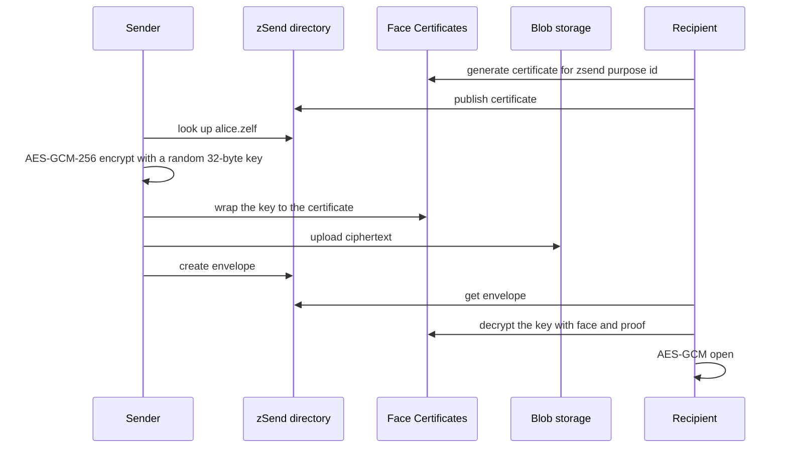

# zSend Overview

zSend transfers a payload that **only the recipient's face can open**.

It is the first Zelf service built on *encrypt-to-someone-else*. [Zelf Keys](../zelf-keys/store) encrypts for yourself; zSend encrypts to a [Face Certificate](../face-certificates/overview) that someone else published under their Zelf name.

The API never receives the plaintext or the content key. A recipient recovers the key with a live face, and nothing stored server-side can substitute for it.

## Two steps, two roles

**Recipient, once per name.** Issue a Face Certificate for the zSend purpose id and publish it to the directory.

**Sender, per transfer.** Look the name up, encrypt the payload locally, wrap the content key to the fetched certificate, and record an envelope.

## Endpoints

All zSend endpoints require a JWT. Create a session with `POST /api/sessions`, then send `Authorization: Bearer <token>` and `Origin`. Missing JWT returns **401**.

| Endpoint | Purpose |
| --- | --- |
| [`GET /api/zsend/purpose-id`](./purpose-id) | Canonical purpose id and crypto parameters for a name |
| [`GET /api/zsend/certificates`](./lookup-certificate) | Sender-side directory lookup |
| [`POST /api/my-zsend/certificates`](./publish-certificate) | Publish or rotate a certificate |
| [`GET /api/my-zsend/certificates`](./publish-certificate#list-your-entries) | Entries published by your session |
| [`DELETE /api/my-zsend/certificates`](./publish-certificate#revoke-an-entry) | Revoke an entry |
| [`POST /api/my-zsend/blobs`](./pin-blob) | Pin ciphertext up to 5 MB |
| [`POST /api/my-zsend/envelopes`](./create-envelope) | Send |
| [`GET /api/my-zsend/envelopes`](./list-envelopes) | Inbox or outbox |
| [`GET /api/my-zsend/envelopes/:envelopeId`](./get-envelope) | Wrapped key and ciphertext pointer |
| [`POST /api/my-zsend/envelopes/:envelopeId/opened`](./get-envelope#mark-as-opened) | Recipient marks opened |
| [`DELETE /api/my-zsend/envelopes/:envelopeId`](./create-envelope#revoke-an-envelope) | Sender revokes |

## Purpose ids

A Face Certificate binds **one purpose id to one face-derived key pair**. zSend derives the purpose id from the recipient's name, so a sender can confirm the certificate it fetched belongs to the name it typed.

```
zsend:alice.zelf     file transfer
zmail:alice.zelf     message
```

Read the value from [`GET /api/zsend/purpose-id`](./purpose-id) rather than building the string. Separate scopes mean a zSend certificate cannot open a message envelope for the same person.

## How a transfer works

Face Certificate `encrypt` wraps a **32–512 byte key**, not a file, so zSend uses hybrid encryption.

1. The sender generates a fresh 32-byte content key and encrypts the payload locally with **AES-GCM-256** and a 12-byte nonce. Only AEAD algorithms are accepted, so a tampered blob fails to open instead of decrypting to garbage.
2. The sender wraps the content key with [`POST /api/my-face-certificates/encrypt`](../face-certificates/encrypt).
3. Optionally, the sender signs the ciphertext digest with [`POST /api/my-face-certificates/sign`](../face-certificates/sign) to prove authorship without revealing their face.
4. [`POST /api/my-zsend/envelopes`](./create-envelope) stores the **wrapped** key, the AEAD parameters, and a pointer to the ciphertext.
5. The recipient recovers the key with [`POST /api/my-face-certificates/decrypt`](../face-certificates/decrypt) — the step that requires the live face — and opens the payload locally.



## Expiry

`expiresInHours` defaults to **72** and is capped at **720**. Reading a lapsed envelope returns **404**, and expiry clears the wrapped key so the transfer stops being openable even if the ciphertext survives elsewhere.

## What the server can and cannot see

**Cannot see:** the payload, the content key, or anything that opens either. Only the recipient's face recovers the content key.

**Can see:** `filename`, `mimeType`, size, sender, recipient, and timestamps. These are stored in the clear so an inbox can render a list. Do not put anything sensitive in a filename.

## Trust model

`POST /api/my-zsend/certificates` verifies every certificate against the Face PKI root before storing it, and refuses anything the root did not sign. A sender that trusts the directory transitively trusts the root, which it can pin independently from [`GET /api/face-certificates/root-certificate`](../face-certificates/root-certificate).

Publishing a certificate is first-write-wins: the publishing session claims the name and is the only one that can rotate the entry or read that inbox.

Never embed issuer or PKI private keys in an application. Certificates are public; only `https://v4.zelf.world` holds the Face PKI signing key.
