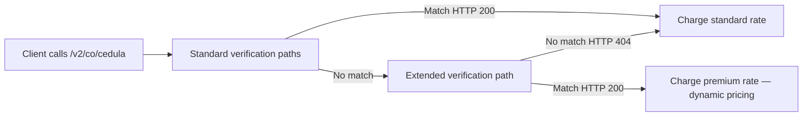

export const structuredData = {
	"@context": "https://schema.org",
	"@type": "TechArticle",
	headline: "Identity Verification in Colombia | Verifik KYC API",
	description:
		"Validate the identity of individuals in Colombia with Verifik’s KYC API. Connect with official sources and verify personal data in seconds.",
	articleSection: "API Documentation",
	keywords: "identity verification, KYC API, Colombia ID validation, official data source, fraud prevention",
	about: {
		"@type": "Thing",
		name: "Identity Verification API",
	},
};

export const faqData = {
	"@context": "https://schema.org",
	"@type": "FAQPage",
	mainEntity: [
		{
			"@type": "Question",
			name: "Is this API compliant with Colombian data protection laws?",
			acceptedAnswer: {
				"@type": "Answer",
				text: "Yes, Verifik complies with Law 1581 of 2012 (Habeas Data) and adheres to KYC/AML regulations set by the UIAF and Financial Superintendence.",
			},
		},
		{
			"@type": "Question",
			name: "What document types can be verified?",
			acceptedAnswer: {
				"@type": "Answer",
				text: "The API supports Cédula de Ciudadanía (CC) for citizens and Permiso por Protección Temporal (PPT) for migrants.",
			},
		},
		{
			"@type": "Question",
			name: "Is the data retrieved in real-time?",
			acceptedAnswer: {
				"@type": "Answer",
				text: "Yes, our API connects directly to official government sources to provide real-time and up-to-date information.",
			},
		},
		{
			"@type": "Question",
			name: "Why was I charged more than the listed cédula price?",
			acceptedAnswer: {
				"@type": "Answer",
				text: "When standard verification paths on GET/POST /v2/co/cedula do not return a match, Verifik may automatically try an extended verification path through Dynamic Query. If that path returns HTTP 200, dynamic pricing applies and you are charged the premium tier for that endpoint family. Pass includeCost=true to see a billing object on the response, or review your API request history for standard vs. charged amounts.",
			},
		},
	],
};

<script type="application/ld+json" dangerouslySetInnerHTML={{ __html: JSON.stringify(structuredData) }} />
<script type="application/ld+json" dangerouslySetInnerHTML={{ __html: JSON.stringify(faqData) }} />

import Tabs from "@theme/Tabs";
import TabItem from "@theme/TabItem";

### Endpoint

```
GET https://api.verifik.co/v2/co/cedula
```

Same path on the app host: `GET https://verifik.app/v2/co/cedula`.

The route also accepts **`POST`** with the same fields in the body (for clients that prefer it).

### Headers

| Name | Value |
| --- | --- |
| Accept | `application/json` |
| Authorization | `Bearer <token>` |

### Document requirements

**Who is this for?** Colombian citizens with a *Cédula de Ciudadanía* (**CC**), or Venezuelan migrants with a *Permiso de Protección Temporal* (**PPT**) when you need **name and identity data** from civil-registry sources.

| Type | Who holds it | `documentType` | Typical length in Colombia | This API accepts |
| --- | --- | --- | --- | --- |
| **CC** | Colombian citizens | `CC` | **3–10** digits (common: **8** or **10** NUIP) | **5–10** digits, digits only |
| **PPT** | Venezuelan migrants (name lookup on this path) | `PPT` | Up to **7** digits | **5–10** digits, digits only |

**How to enter `documentNumber`:** digits only — no dots, spaces, or dashes. Example CC: `1032386359`.

**Use a different endpoint for:**
- **CE** (*Cédula de Extranjería*) → [Colombia CE](/identity/colombia-ce) (`/v2/co/foreigner-id/ce` + `expeditionDate`)
- **PPT immigration status** (VIGENTE / expiration) → [Colombia PPT](/identity/colombia-ppt) (`/v2/co/foreigner-id/ppt` + `expeditionDate`)
- **Immigration PEP** (*Permiso Especial de Permanencia*, 15 digits) → [Colombia PEP](/identity/colombia-pep-id)

Full comparison: [Colombia identity documents guide](/identity-validation/colombia/colombia-identity-documents-guide).

### Parameters

| Name | Type | Required | Description |
| --- | --- | --- | --- |
| `documentType` | string | Yes | **`CC`** (*Cédula de Ciudadanía*) or **`PPT`** (*Permiso de Protección Temporal*). **`NIT`**, **`CE`**, and immigration **`PEP`** are **not** accepted here — see the [documents guide](/identity-validation/colombia/colombia-identity-documents-guide). |
| `documentNumber` | string | Yes | Document number, **digits only** (no spaces or periods). **5–10** characters (API validation). CC is commonly **8** or **10** digits; PPT is often **up to 7** digits in official records. Example: `1032386359`. |

### Dynamic pricing {#dynamic-pricing}

This endpoint participates in Verifik's **Dynamic Query** architecture. In most cases you pay the **standard rate** for `/v2/co/cedula`. When standard verification paths do not return a match, an **extended verification path** may run automatically. If that path returns **HTTP 200**, **dynamic pricing** applies and credits are deducted at the **premium tier** for this endpoint family—not the standard tier.

**Price expectation:** From your account's **standard rate** · up to **premium rate** (see your plan, Postman, or the client panel).



**Optional billing transparency:** pass query parameter **`includeCost=true`** on your request. When credits are charged, the response may include a **`billing`** object when dynamic pricing applies:

```json
"billing": {
  "dynamicQueryApplied": true,
  "adjustmentType": "dynamic_query_premium",
  "standardCredits": 0.3,
  "chargedCredits": 2,
  "standardFeatureCode": "colombia_api_identity_lookup",
  "billedFeatureCode": "colombia_api_identity_lookup_premium"
}
```

Credit amounts are **illustrative**; actual values depend on your plan.

- **SLA:** [Dynamic pricing (billing)](/legal/service-level-agreement#viiia-dynamic-pricing-billing)
- **Direct premium route:** Contact Verifik support for the explicit premium route documentation. It always uses premium pricing.

### Request

<Tabs>
  <TabItem value="node" label="Node.js">

```javascript
import axios from "axios";

const options = {
	method: "GET",
	url: "https://api.verifik.co/v2/co/cedula",
	params: { documentType: "CC", documentNumber: "123456789" },
	headers: {
		Accept: "application/json",
		Authorization: `Bearer ${process.env.VERIFIK_TOKEN}`,
	},
};

const { data } = await axios.request(options);
console.log(data);
```

  </TabItem>
  <TabItem value="python" label="Python">

```python
import os, requests

url = "https://api.verifik.co/v2/co/cedula"
headers = {
    "Accept": "application/json",
    "Authorization": f"Bearer {os.getenv('VERIFIK_TOKEN')}"
}
params = {
    "documentType": "CC",
    "documentNumber": "123456789"
}
r = requests.get(url, headers=headers, params=params)
print(r.json())
```

  </TabItem>
</Tabs>

### Response

<Tabs>
  <TabItem value="200" label="200">

```json
{
	"data": {
		"documentType": "CC",
		"documentNumber": "123456789",
		"firstName": "Juan",
		"lastName": "Pérez",
		"fullName": "Juan Pérez"
	},
	"signature": {
		"message": "Certified by Verifik.co",
		"dateTime": "January 16, 2024 3:44 PM"
	},
	"id": "AB123"
}
```

  </TabItem>
  <TabItem value="404" label="404">

```json
{
	"message": "Document not found",
	"code": "DOCUMENT_NOT_FOUND"
}
```

  </TabItem>
  <TabItem value="401" label="401">

```json
{
	"message": "Authentication required",
	"code": "UNAUTHORIZED"
}
```

  </TabItem>
</Tabs>

### Notes

- Use **`documentType=CC`** for Colombian national ID (*cédula*) and **`PPT`** for *Permiso de Protección Temporal* name lookup. Do **not** use **`NIT`** here (business/tax endpoints) or **`CE`** / immigration **`PEP`** (foreigner-id endpoints).
- Some UIs list **`NIT`** or **`CE`** next to identity checks by mistake; the public validator for **`/v2/co/cedula`** only allows **`CC`** and **`PPT`**.
- See the [Colombia identity documents guide](/identity-validation/colombia/colombia-identity-documents-guide) for digit-length details and endpoint routing.

---

### Identity Verification in Colombia

Verifik's Identity Verification API helps you authenticate Colombian citizens using official government data. It's designed to streamline your KYC (Know Your Customer) processes, prevent fraud, and ensure you meet all regulatory requirements effortlessly.

We built this integration for businesses that need a fast, secure, and automated way to confirm the true identity of users, employees, or customers.

### What does this API validate?

Our API connects directly with official records to validate:

-   **Full name & ID number**: *Cédula de Ciudadanía* (**CC**) or *Permiso por Protección Temporal* (**PPT**) — not *Cédula de Extranjería* (**CE**); use the dedicated [Colombia CE](/identity/colombia-ce) flow for CE.
-   **Document status**: Checks status against official civil-registry and related sources used for this integration.
-   **Identity match**: Confirms that returned identity data corresponds to the document number queried.

By verifying these details, you can be confident that the person you're dealing with is real and holds a valid document, significantly lowering the risk of impersonation and fraud.

### Common Use Cases

-   **Fintech & Banking**: Verify identities instantly during account opening or loan applications.
-   **E-commerce & Delivery**: Authenticate users and couriers before they become active on your platform.
-   **HR & Recruitment**: Validate candidate documents as part of your hiring workflow.
-   **Insurance & Healthcare**: Confirm identities before issuing policies or providing medical benefits.

### Official Sources & Reliability

We connect directly with Colombia's *Registraduría Nacional del Estado Civil* to ensure you receive verified, up-to-the-minute information.
Every query is handled with strict adherence to security and regulatory standards, including:

-   **Law 1581 of 2012** (Personal Data Protection)
-   **KYC/AML Circulars** from the UIAF and Financial Superintendence of Colombia

### Key Benefits

-   **Automated Compliance**: Streamline your KYC checks to prevent fraud without adding friction for your users.
-   **Instant Results**: Process verifications in seconds, perfect for real-time digital onboarding.
-   **Trusted Data**: Rely on data sourced directly from the Colombian government.
-   **Easy Integration**: Connect easily via our REST API or use our compatible SDKs.

### Compliance & Security

We prioritize the safety of your data. Verifik uses advanced encryption (HTTPS/TLS 1.3) and strict privacy management standards to ensure confidentiality.
Our service is monitored 24/7 for availability and offers role-based access controls to keep your team's access secure.

### About Verifik

Verifik is a leading platform for identity verification, compliance, and fraud prevention across Latin America.
Our APIs automate KYC, KYB, AML, and biometric validation processes, connecting businesses with official data sources in Colombia, Mexico, Peru, Chile, Uruguay, and beyond.

### Related APIs

Explore other verification services in the Colombian ecosystem:

-   [**INPEC Background Check**](/background-check/colombia-inpec): Verify criminal records and judicial history.
-   [**SIGEP Public Servant Verification**](/legal/sigep-public-servant-by-number): Validate public employment status.
-   [**RUNT Vehicle Validation**](/vehicle-validation/colombia/runt-vehicle-by-plate): Check vehicle history and ownership.

### Frequently Asked Questions (FAQ)

<details>
  <summary>Is this API compliant with Colombian data protection laws?</summary>
  <div>
    Yes, Verifik complies with <strong>Law 1581 of 2012 (Habeas Data)</strong> and adheres to KYC/AML regulations set by the UIAF and Financial Superintendence. We ensure all data is processed securely and with proper authorization.
  </div>
</details>

<details>
  <summary>What document types can be verified?</summary>
  <div>
    The API supports <strong>Cédula de Ciudadanía (CC)</strong> for Colombian citizens and <strong>Permiso por Protección Temporal (PPT)</strong> for Venezuelan migrants.
  </div>
</details>

<details>
  <summary>Is the data retrieved in real-time?</summary>
  <div>
    Yes, our API connects directly to official government sources to provide <strong>real-time</strong> and up-to-date information, ensuring you always have the latest status of an identity.
  </div>
</details>


