# Zelf x Stellar: Privacy-Preserving Identity Verification System

## Executive Summary

**Project Name:** Zelf Passport Proofs for Stellar Network  
**Requested Funding:** $50,000 - $80,000 USD  
**Timeline:** 3-4 months (MVP), 8-10 months (Full Phase 1)  
**Team Size:** 3 developers (iOS, Android, Extension)  
**MVP Focus:** Latin America + US remittance corridor

Zelf proposes to build a privacy-preserving identity verification system for the Stellar network that enables regulatory compliance without compromising user privacy. By leveraging NFC passport technology and Zelf's proprietary biometric-to-deterministic-key algorithm, we will create the first truly self-sovereign KYC solution for Stellar anchors and ecosystem participants.

**MVP Strategy:** Launch first in Stellar's highest-impact region (Latin America-US corridor) to validate the solution with real users and anchors before global expansion. This focused approach reduces development time by 30-40% while delivering immediate value to Stellar's most active remittance market.

---

## The Problem

### Current State of KYC in Stellar Ecosystem

Stellar anchors face a fundamental tension:

1. **Regulatory Requirements**
   - Must verify user identity (KYC/AML compliance)
   - Must screen against sanctions lists
   - Must verify age/jurisdiction eligibility
   - Must maintain audit trails

2. **Privacy & Security Challenges**
   - Storing passport scans creates massive liability
   - Centralized databases are honeypots for hackers
   - Users must repeat KYC for every anchor (poor UX)
   - GDPR/data protection regulations increase compliance costs

3. **User Experience Problems**
   - Friction in onboarding (upload docs, wait for review)
   - Privacy concerns (who has access to my passport?)
   - No portability (can't reuse verification across services)
   - Distrust of centralized KYC providers

### Why This Matters for Stellar

- **Barrier to Entry:** Small anchors avoid Stellar due to KYC compliance costs
- **User Adoption:** Privacy-conscious users avoid platforms requiring document uploads
- **Regulatory Risk:** Centralized KYC databases create systemic risk
- **Competitive Disadvantage:** Other chains exploring decentralized identity solutions

### Why Latin America MVP Makes Strategic Sense

**Market Alignment:**
- **$150B+ annual remittances** from US to Latin America (World Bank data)
- **Stellar's proven traction**: Felix & Bitso already serving WhatsApp-based remittances
- **MoneyGram presence**: Part of 475K+ global cash-to-crypto locations with heavy Latin American coverage
- **High smartphone penetration**: 70%+ in major markets (Mexico, Brazil, Colombia)

**Technical Advantages:**
- **6 countries vs 20+**: Reduces CSCA database complexity by 70%
- **Regional cooperation**: Many Latin American countries share digital identity standards
- **Similar passport formats**: Streamlined NFC chip compatibility testing
- **Time zone alignment**: US + Latin America enables real-time support during development

**Regulatory Benefits:**
- **Digital ID frameworks**: Mexico (e.firma), Brazil (CPF digital), Argentina (DNI digital)
- **Crypto-friendly**: El Salvador (Bitcoin legal tender), Brazil (crypto regulation 2024)
- **Privacy laws align**: Many based on GDPR principles, easier compliance path

**Go-to-Market Advantages:**
- **Spanish + English**: Covers 95%+ of corridor users with 2 languages vs 10+
- **Existing ecosystem**: Can partner with local Stellar anchors and wallets
- **Faster validation**: Prove product-market fit before global expansion
- **Lower risk**: If MVP fails, haven't over-invested in global infrastructure

**Competitive Positioning:**
- **First-mover**: No existing privacy-preserving KYC for Latin America crypto corridor
- **Network effects**: Success in Latin America creates blueprint for other regions
- **Reference customers**: Latin American anchors can evangelize to global partners

---

## Our Solution: Zelf Passport Proofs

### Core Innovation: Biometric-to-Deterministic-Key Algorithm

Zelf has developed a **proprietary algorithm** that solves a fundamental challenge in biometric cryptography:

**Traditional Problem:**
- Biometric data is "fuzzy" (slight variations each scan)
- Cannot be used directly as cryptographic keys
- Requires probabilistic matching (less secure)

**Zelf's Solution:**
- Converts fuzzy biometric data → deterministic cryptographic keys
- Same biometric always produces same key (reproducible)
- Enables true self-sovereign encryption (no key storage needed)

**Critical Privacy Advantage:**
- **We never store biometric data** - only the key derived from it
- Complies with GDPR Article 9 (biometric data processing)
- Satisfies European privacy regulations
- Eliminates biometric database breach risk

### How It Works

```mermaid
graph LR
    A[User Scans NFC Passport] --> B[Extract Passport Data]
    B --> C[Verify Government Signature]
    C --> D[Capture Biometric]
    D --> E[Generate Deterministic Key]
    E --> F[Encrypt Passport Data]
    F --> G[Create ZelfProof]
    G --> H[User Stores Proof Locally]
    H --> I[Selective Disclosure to Stellar Anchor]
    I --> J[Anchor Verifies Claims]
    J --> K[Approve/Deny Access]
```



### Architecture Components

#### 1. NFC Passport Reading
```typescript
interface NFCPassportData {
  // ICAO 9303 Standard Data
  mrz: MachineReadableZone;
  personalData: {
    fullName: string;
    dateOfBirth: string;      // YYMMDD
    nationality: string;
    documentNumber: string;
    expiryDate: string;
    gender: string;
  };
  
  // Government-issued cryptographic proof
  digitalSignature: {
    signature: Buffer;
    signerCertificate: X509Certificate;
    issuerChain: X509Certificate[];
  };
  
  // Biometric data (optional, varies by country)
  biometrics?: {
    facialImage: Buffer;
    fingerprints?: Buffer;
  };
}
```

**Technical Implementation:**
- **iOS:** CoreNFC framework (NFC Data Exchange Format)
- **Android:** Android NFC APIs (ISO 14443)
- **Standard:** ICAO 9303 (Machine Readable Travel Documents)
- **Security:** BAC (Basic Access Control) using MRZ as key

#### 2. Government Signature Verification

```typescript
interface GovernmentSignatureVerification {
  // ICAO PKI Infrastructure
  verification: {
    // Country Signing Certificate Authority
    csca: CSCACertificate;
    
    // Document Signer Certificate
    dsCertificate: DSCertificate;
    
    // Certificate chain validation
    chainOfTrust: CertificateChain;
    
    // Signature verification result
    isValid: boolean;
    issuerCountry: string;
    issueDate: Date;
  };
}
```

**Complexity Analysis:**

| Component | Complexity | Timeline | Approach |
|-----------|-----------|----------|----------|
| ICAO PKI Integration | High | 8-10 weeks | Custom implementation |
| CSCA Database | Medium | 4-6 weeks | ICAO masterlist + updates |
| Certificate Validation | Medium | 4-5 weeks | OpenSSL/BouncyCastle |
| Country Support | Ongoing | - | Incremental rollout |

**Initial Country Support (MVP - Latin America + US Corridor):**
- **United States** (primary remittance sender)
- **Mexico** (largest Latin American remittance recipient)
- **El Salvador** (Bitcoin Law, high Stellar activity)
- **Brazil** (largest Latin American economy)
- **Colombia** (growing remittance market)
- **Argentina** (high crypto adoption)

**Rationale for MVP Focus:**
- **Felix & Bitso** already operating WhatsApp remittances in this corridor
- **MoneyGram** has extensive presence in Latin America (part of 475K+ locations)
- **High remittance volume**: $150B+ annually from US to Latin America
- **Regulatory alignment**: Many countries have established digital identity frameworks
- **Proven demand**: Stellar's most active use case region

**Post-MVP Expansion (Phase 2):**
- European Union (Schengen area)
- United Kingdom
- Canada
- Australia
- Major Asian economies (Japan, Singapore, South Korea)

**Database Maintenance:**
- ICAO maintains global CSCA masterlist
- Quarterly updates for new certificates
- Automated validation pipeline
- Fallback to manual verification for edge cases

#### 3. Biometric Encryption Layer

```typescript
interface ZelfBiometricEncryption {
  // Zelf's proprietary algorithm
  biometricToKey: {
    input: BiometricData;        // Facial recognition, fingerprint, etc.
    output: DeterministicKey;    // Always same key for same biometric
    
    // Key properties
    keyStrength: 256;            // 256-bit encryption
    reproducibility: 100;         // 100% reproducible
    fuzzyTolerance: 'high';      // Handles natural variation
  };
  
  // Passport data encryption
  encryption: {
    algorithm: 'AES-256-GCM';
    key: DeterministicKey;       // Derived from biometric
    encryptedData: EncryptedPassportData;
  };
  
  // ZelfProof creation
  proof: {
    type: 'PassportVerification';
    encryptedPayload: Buffer;
    metadata: {
      created: Date;
      expiresAt: Date;
      proofVersion: string;
    };
  };
}
```

**Privacy Guarantees:**
- ✅ Biometric data never leaves device
- ✅ No biometric database (only keys derived from biometrics)
- ✅ Passport data encrypted at rest
- ✅ User controls decryption (via biometric re-scan)
- ✅ GDPR Article 9 compliant (biometric data processing)

#### 4. Selective Disclosure for Stellar

```typescript
interface StellarKYCClaims {
  // Age verification (without revealing exact DOB)
  ageVerification: {
    isOver18: boolean;
    isOver21: boolean;
    // Proof: DOB extracted, compared to threshold, re-encrypted
  };
  
  // Jurisdiction compliance (without revealing exact nationality)
  jurisdictionVerification: {
    isNotSanctionedCountry: boolean;
    isEligibleJurisdiction: boolean;  // e.g., "is EU citizen"
    // Proof: Nationality extracted, checked against lists, re-encrypted
  };
  
  // Document validity
  documentVerification: {
    hasValidGovernmentID: boolean;
    governmentSignatureValid: boolean;
    documentNotExpired: boolean;
    // Proof: Government signature verified, expiry checked
  };
  
  // Sybil resistance
  uniquenessVerification: {
    uniquePassportHash: string;  // SHA-256(documentNumber + issuer)
    // Prevents duplicate accounts without revealing passport number
  };
  
  // Cryptographic proof bundle
  proofBundle: {
    claims: ClaimSet;
    governmentSignature: VerifiedSignature;
    zelfProofSignature: Signature;
    timestamp: Date;
  };
}
```

**Selective Disclosure Implementation:**

```typescript
// User flow for Stellar anchor verification
async function proveEligibilityToAnchor(
  zelfProof: ZelfProof,
  requiredClaims: string[]
): Promise<StellarKYCProof> {
  
  // 1. User authenticates with biometric
  const biometricKey = await captureBiometric();
  
  // 2. Decrypt only necessary fields (not full passport)
  const decryptedClaims = await selectiveDecrypt(
    zelfProof,
    biometricKey,
    requiredClaims  // e.g., ['dateOfBirth', 'nationality']
  );
  
  // 3. Generate proofs for each claim
  const proofs = await generateClaimProofs(decryptedClaims, requiredClaims);
  
  // 4. Re-encrypt and sign proof bundle
  const proofBundle = await createProofBundle(proofs);
  
  // 5. Share with anchor (no raw passport data exposed)
  return proofBundle;
}
```

**Key Innovation - Selective Decryption:**
- Decrypt only specific fields needed for verification
- Re-encrypt immediately after claim generation
- Raw passport data never persists in memory
- User approves each disclosure request

---

## Stellar Ecosystem Integration

### SEP-12 KYC Middleware

```typescript
// filepath: stellar-sep12-middleware-example.ts

/**
 * Zelf-powered SEP-12 KYC API
 * Drop-in replacement for traditional KYC providers
 */

interface SEP12ZelfIntegration {
  // Standard SEP-12 endpoints
  endpoints: {
    '/customer': CustomerInfoEndpoint;
    '/customer/verification': VerificationEndpoint;
    '/customer/callback': CallbackEndpoint;
  };
  
  // Zelf-specific flow
  verification: {
    // 1. Anchor requests KYC
    request: {
      accountId: string;
      requiredFields: string[];  // 'age', 'jurisdiction', etc.
    };
    
    // 2. User provides ZelfProof
    proof: {
      zelfProofId: string;
      claims: StellarKYCClaims;
      signature: Signature;
    };
    
    // 3. Anchor verifies proof
    verification: {
      governmentSignatureValid: boolean;
      claimsValid: boolean;
      proofNotExpired: boolean;
    };
    
    // 4. Anchor approves/denies
    result: 'approved' | 'denied' | 'pending';
  };
}
```

### Anchor Integration Example

```typescript
// Example: Stellar anchor verifies user without storing passport data

import { ZelfPassportVerifier } from '@zelf/stellar-sdk';

const verifier = new ZelfPassportVerifier({
  anchorDomain: 'myanchor.stellar.org',
  requiredClaims: ['isOver18', 'isNotSanctionedCountry', 'documentValid']
});

// User submits ZelfProof
const result = await verifier.verify(userProof);

if (result.approved) {
  // Anchor approves user for Stellar account
  await approveCustomer(result.accountId);
  
  // No passport data stored on anchor side
  // Anchor only stores: proofHash, verificationTimestamp, expiryDate
}
```

### Benefits for Stellar Anchors

| Traditional KYC | Zelf Passport Proofs |
|----------------|---------------------|
| Store passport scans | Store only proof hashes |
| Liability for data breaches | No sensitive data = no liability |
| Manual review process | Automated cryptographic verification |
| $10-50 per verification | Near-zero marginal cost |
| Siloed data (per anchor) | Reusable across ecosystem |
| GDPR compliance burden | Privacy-by-design compliance |
| Weeks to set up | Days to integrate |

---

## Roadmap & Timeline

### MVP: Latin America + US Corridor (3-4 months) - Grant Scope

**Focus:** Deliver working solution for Stellar's highest-impact remittance corridor with 6-country support.

#### Month 1: NFC Passport Reader (Core Countries)
**Team:** iOS + Android developers

**Deliverables:**
- NFC reader implementation (ICAO 9303)
- MRZ parsing and validation
- Support for US, Mexico, Brazil, Colombia, Argentina, El Salvador passports
- Biometric data extraction (facial image)
- Device compatibility testing (iOS/Android)

**Milestones:**
- ✅ Week 2: Basic NFC reading functional on iOS
- ✅ Week 3: Basic NFC reading functional on Android  
- ✅ Week 4: MRZ validation and 6-country passport support complete

**Technical Focus:**
- Prioritize passport formats from target countries
- Test with real passports from Latin American embassies/consulates

#### Month 2: Government Signature Verification (Latin America + US)
**Team:** Extension + Backend developer

**Deliverables:**
- ICAO PKI certificate chain validation
- CSCA database for US + 5 Latin American countries
- Document Signer Certificate verification
- Automated CSCA updates for target countries

**Milestones:**
- ✅ Week 6: CSCA database for US + Mexico complete
- ✅ Week 7: Brazil, Colombia, Argentina, El Salvador added
- ✅ Week 8: Full certificate chain validation working for all 6 countries

**Technical Focus:**
- Work with US State Department CSCA
- Integrate Latin American country CSCAs (some have regional cooperation)
- Validate against real passports

#### Month 3: Biometric Encryption & Selective Disclosure
**Team:** All developers

**Deliverables:**
- Integrate Zelf's biometric-to-key algorithm
- Encrypt passport data with biometric key
- ZelfProof creation and storage
- Selective field decryption (age, nationality, etc.)
- Claim generation (isOver18, isNotSanctionedCountry, etc.)
- User consent flow for disclosure

**Milestones:**
- ✅ Week 10: Biometric capture + key generation working
- ✅ Week 11: Full passport encryption pipeline functional
- ✅ Week 12: Selective disclosure + claim generation complete

**Technical Focus:**
- Test reproducibility across Latin American user demographics
- Optimize for varying lighting conditions (important for emerging markets)
- Spanish language UI/UX for Latin American users

#### Month 3-4: Stellar Integration & Pilot Launch
**Team:** All developers + QA

**Deliverables:**
- SEP-12 KYC middleware implementation
- Stellar anchor SDK/API
- Integration with 1-2 pilot anchors in Latin America
- End-to-end testing with real users
- Security audit (focused scope for MVP)
- Developer documentation (English + Spanish)

**Milestones:**
- ✅ Week 13: SEP-12 middleware functional
- ✅ Week 14-15: Pilot anchor integration (target: Latin American anchor + US partner)
- ✅ Week 16: Security audit and critical bug fixes
- ✅ Week 16: MVP launch with bilingual documentation

**Pilot Anchor Partnerships (Target):**
- **Primary:** Partner with existing Stellar Latin America anchor (e.g., Bitso partner, local anchor)
- **Secondary:** US-based anchor serving Latin American remittances
- **Metric:** 100-500 verified users in first month

**MVP Success Criteria:**
- ✅ 6-country passport support (US + 5 Latin American)
- ✅ 1-2 production anchor integrations
- ✅ &gt;90% verification success rate
- ✅ &lt;45 seconds average verification time
- ✅ Security audit passed (no critical vulnerabilities)
- ✅ 100+ real user verifications

---

### Phase 1: Full Global Rollout (Months 5-10 - Post-MVP)

**Funding:** Additional Stellar grants, revenue from anchor partnerships

#### Month 5-7: Geographic Expansion
- Add 15+ additional countries (EU, UK, Canada, Australia, Asia)
- Expand CSCA database to 20+ countries
- Multi-language support (10+ languages)
- Regional compliance (GDPR for EU, etc.)

#### Month 8-9: Advanced Features
- Full Zero-Knowledge Proofs (zk-SNARKs implementation)
- Additional document types (national IDs for countries without NFC passports)
- Multi-document proofs (passport + utility bill for address)
- Enhanced sanctions screening integration

#### Month 10: Enterprise Integration
- Onboard 5+ additional Stellar anchors globally
- Wallet integration (Lobstr, StellarTerm, etc.)
- DEX integration for age-gated trading
- White-label SDK for enterprises

---

### Phase 2: Ecosystem Expansion (Months 11-14)

**Funding:** Revenue from anchor partnerships, additional Stellar grants

#### Advanced Features
- **Full Zero-Knowledge Proofs:** Production-ready zk-SNARKs (if not completed in Phase 1)
- **Additional Document Types:** Driver's licenses, national IDs for non-NFC countries
- **Multi-Document Proofs:** Combine credentials (passport + proof of address)
- **Biometric alternatives:** Fingerprint support for devices without face scanning

#### Ecosystem Integration
- **Major Wallet Integration:** Partner with Lobstr, StellarTerm, Solar, etc.
- **DEX Integration:** Age-gated trading for restricted assets on Stellar DEX
- **Airdrop Platform:** Sybil-resistant distribution system for Stellar projects
- **MoneyGram Integration:** KYC for MoneyGram's 475K+ cash-to-crypto locations

#### Geographic Expansion
- Support 50+ countries for passport verification
- All major remittance corridors (Asia-Pacific, Africa, Middle East)
- Region-specific compliance frameworks
- Localization (20+ languages)

---

### Phase 3: Stellar's Primary Identity Solution (12+ months)

#### Vision: Industry Standard for Blockchain KYC

**Objective:** Become the **de facto privacy-preserving identity layer** for Stellar ecosystem

**Expansion Areas:**

1. **Regulatory Alignment**
   - Work with regulators (SEC, EU authorities, etc.)
   - Demonstrate GDPR/CCPA compliance
   - Create compliance frameworks for anchors
   - Establish legal precedents for ZK-KYC

2. **Enterprise Adoption**
   - Onboard major Stellar anchors (Circle, TEMPO, etc.)
   - Integrate with institutional platforms
   - White-label solutions for enterprises
   - SLA and support infrastructure

3. **Cross-Chain Expansion**
   - Extend beyond Stellar (Ethereum, Solana, etc.)
   - Universal identity layer for DeFi
   - Interoperability standards
   - Multi-chain proof verification

4. **Advanced Privacy Features**
   - Anonymous credentials (Idemix, U-Prove)
   - Revocation without revealing identity
   - Aggregated proofs (prove membership in set)
   - Privacy-preserving audit trails

5. **Developer Ecosystem**
   - Open-source SDK and tools
   - Bounty program for integrations
   - Hackathons and developer education
   - Reference implementations

**Success Metrics:**
- **50%** of Stellar anchors using Zelf Passport Proofs within 18 months
- **100K+** verified users on Stellar network
- **$1M+** in KYC costs saved for anchors
- **Zero** data breaches (vs. industry average)

---

## Budget Breakdown

**Total Requested:** $50,000 - $80,000 USD  
**Timeline:** 3-4 months (MVP)

### Personnel Costs (MVP: 4 months)

| Role | Monthly Rate | Duration | Total |
|------|-------------|----------|-------|
| **iOS Developer** | $8,000 | 4 months | $32,000 |
| **Android Developer** | $8,000 | 4 months | $32,000 |
| **Extension/Backend Developer** | $8,000 | 4 months | $32,000 |
| **Subtotal Personnel** | | | **$96,000** |

### Infrastructure & Services (MVP Scope)

| Item | Cost | Notes |
|------|------|-------|
| **ICAO PKI Database** | $2,500 | CSCA for 6 countries (US + 5 Latin American) |
| **Cloud Infrastructure** | $2,000 | Testing, staging, MVP production |
| **Security Audit** | $10,000 | Focused scope (6 countries, MVP features) |
| **Legal/Compliance** | $3,000 | Latin America + US regulatory guidance |
| **Translation Services** | $1,500 | Spanish localization for UI/docs |
| **Subtotal Infrastructure** | **$19,000** | |

### Contingency & Miscellaneous

| Item | Cost | Notes |
|------|------|-------|
| **Contingency (10%)** | $11,500 | Unexpected challenges |
| **Testing Devices** | $2,000 | iOS/Android devices, NFC readers |
| **Documentation & Marketing** | $1,500 | Developer docs (EN + ES), case studies |
| **Travel** | $2,000 | Latin American anchor partnership meetings (optional) |
| **Subtotal Contingency** | **$17,000** | |

### **MVP Total: $132,000**

### Grant Request Justification

**Requested from Stellar: $50,000 - $80,000**

**Zelf Contribution: $52,000 - $82,000**
- In-kind developer time (proprietary algorithm integration)
- Existing infrastructure (biometric system, ZelfProof platform)
- Ongoing maintenance and support

**Grant Allocation (MVP):**
- **NFC & Government Signature Development:** $35,000 (44%)
- **Stellar Integration & Pilot Anchors:** $25,000 (31%)
- **Security Audit & Infrastructure:** $15,000 (19%)
- **Localization & Documentation:** $5,000 (6%)

**Why MVP First:**
- **30-40% faster time-to-market** (3-4 months vs 5-6 months)
- **Validate with real users** in Stellar's most active region
- **Lower risk**: Prove value before global expansion
- **Immediate impact**: $150B+ annual remittance market
- **Strategic fit**: Aligns with existing Stellar initiatives (Felix/Bitso, MoneyGram)

---

## Why Zelf is Uniquely Positioned

### 0. MVP-First Approach: 30-40% Faster Time-to-Market

**Development Time Comparison:**

| Approach | Timeline | Countries | Risk | Time to Value |
|----------|----------|-----------|------|---------------|
| **Global Launch** | 5-6 months | 20+ countries | High | 6 months |
| **MVP (Latin America)** | 3-4 months | 6 countries | Low | 4 months |
| **Time Saved** | **30-40%** | **70% fewer** | **Validated** | **33% faster** |

**How We Save Time:**
1. **CSCA Database**: 6 countries vs 20+ = 70% less certificate management
2. **Testing**: Single region = consistent passport formats, fewer edge cases
3. **Localization**: 2 languages (Spanish + English) vs 10+
4. **Compliance**: 1 regulatory framework (Latin America + US) vs 5+
5. **Partnerships**: Focus on 1-2 anchors in target corridor vs broad outreach

**Why This Matters:**
- **Faster ROI for Stellar**: Working solution in 4 months vs 6 months
- **Lower risk**: Validate before global expansion investment
- **Iterative improvement**: User feedback informs Phase 2 development
- **Proof of concept**: Easier to secure additional funding with traction

### 1. Proprietary Technology Advantage

**Zelf's biometric-to-deterministic-key algorithm is our competitive moat:**
- No other solution can convert fuzzy biometrics to deterministic keys
- Enables true self-sovereign encryption (no key storage)
- Already battle-tested in production (wallet seed phrase encryption)

**This Cannot Be Replicated:**
- Years of R&D investment
- Proprietary algorithms and trade secrets
- Patent-pending technology

### 2. Privacy-First Architecture

**GDPR & European Regulation Compliance:**
- ✅ Article 9: Biometric data processing (we don't store biometrics, only derived keys)
- ✅ Article 17: Right to erasure (user deletes ZelfProof, data gone)
- ✅ Article 25: Privacy by design (encryption at source)
- ✅ Article 32: Security of processing (government-grade cryptography)

**No Other Solution Offers:**
- Zero biometric storage (eliminates database breach risk)
- User-controlled encryption keys (no corporate access)
- Verifiable government signatures (no trust required)

### 3. Alignment with Stellar's Mission

**Stellar Goals:**
- ✅ Financial inclusion (reduce KYC friction in emerging markets)
- ✅ Cross-border payments (enable compliant international transfers)
- ✅ Anchor ecosystem growth (lower barriers to entry)
- ✅ Regulatory compliance (meet AML/KYC requirements)
- ✅ User privacy (protect sensitive data)

**Zelf Passport Proofs Directly Address:**
- Lower KYC costs → more anchors join Stellar
- Better UX → more users adopt Stellar
- Privacy guarantees → regulatory approval in strict jurisdictions (EU)
- Reusable proofs → network effects across ecosystem

### 4. Proven Execution Capability

**Existing Zelf Products:**
- Biometric wallet encryption (in production)
- ZelfProof system (deployed and tested)
- Multi-platform development (iOS, Android, Extension)

**Team Expertise:**
- 3 full-time developers with blockchain experience
- Cryptographic engineering background
- Regulatory compliance knowledge

---

## Success Metrics & KPIs

### MVP Launch (Month 4)

| Metric | Target | Measurement |
|--------|--------|-------------|
| **Country Support** | 6 countries | US + 5 Latin American countries (Mexico, Brazil, Colombia, Argentina, El Salvador) |
| **Pilot Anchors** | 1-2 integrations | Production deployments in Latin America corridor |
| **Verified Users** | 100-500 users | Real user verifications in first month |
| **Verification Success Rate** | &gt;90% | Valid passports correctly verified |
| **Average Verification Time** | &lt;45 seconds | User scan to anchor approval |
| **Security Audit** | Pass | No critical vulnerabilities |
| **Localization** | Spanish + English | Full UI/UX and documentation |

### Phase 1 Complete (Month 10)

| Metric | Target | Measurement |
|--------|--------|-------------|
| **Country Support** | 20+ countries | Global coverage including EU, Asia, Africa |
| **Active Anchors** | 5+ anchors | Using Zelf Passport Proofs in production |
| **Verified Users** | 5,000+ users | Unique ZelfProofs created |
| **Cost Savings** | $50K+ | Anchor KYC costs eliminated |
| **Remittance Volume** | $10M+ | Cross-border transactions using Zelf verification |
| **User Satisfaction** | &gt;4.5/5 | App store ratings |

### Phase 2 Complete (Month 14)

| Metric | Target | Measurement |
|--------|--------|-------------|
| **Active Anchors** | 10+ anchors | Global anchor adoption |
| **Verified Users** | 25,000+ users | Growing network effect |
| **Cost Savings** | $250K+ | Cumulative KYC costs saved |
| **Data Breaches** | 0 | No sensitive data compromised |
| **Geographic Reach** | 50+ countries | Major remittance corridors covered |

### Phase 3 (18-24 months)

| Metric | Target | Measurement |
|--------|--------|-------------|
| **Market Penetration** | 30%+ of Stellar anchors | Industry adoption in Latin America first |
| **Total Users** | 100K+ verified users | Network effect achieved |
| **Geographic Reach** | 100+ countries supported | Full global coverage |
| **Regulatory Approval** | Latin America frameworks | Legal precedents set for region |

---

## Risk Mitigation

### Technical Risks

| Risk | Likelihood | Impact | Mitigation |
|------|-----------|--------|------------|
| **NFC chip incompatibility** | Medium | Medium | Extensive device testing, fallback to QR codes |
| **Government signature changes** | Low | High | Automated CSCA updates, monitoring |
| **Biometric key drift** | Low | High | Fuzzy matching thresholds, re-enrollment flow |
| **Security vulnerabilities** | Medium | Critical | Third-party audit, bug bounty program |

### Regulatory Risks

| Risk | Likelihood | Impact | Mitigation |
|------|-----------|--------|------------|
| **GDPR non-compliance** | Low | Critical | Legal review, privacy-by-design architecture |
| **Country-specific restrictions** | Medium | Medium | Modular design, jurisdiction-specific features |
| **KYC law changes** | Medium | Medium | Flexible claim system, regular updates |

### Adoption Risks

| Risk | Likelihood | Impact | Mitigation |
|------|-----------|--------|------------|
| **Anchor resistance** | Medium | High | Pilot partnerships, clear ROI demonstration |
| **User trust concerns** | Medium | Medium | Education, transparency, open-source components |
| **Competing solutions** | Low | Medium | First-mover advantage, proprietary tech moat |

---

## Long-Term Vision: Stellar's Identity Layer

### The Opportunity

**Current State:**
- Every blockchain struggles with identity/KYC
- Centralized solutions dominate (Jumio, Onfido, etc.)
- Privacy vs. compliance is unsolved problem
- Billions spent annually on redundant KYC

**Future State with Zelf:**
- **Stellar becomes first blockchain with privacy-preserving KYC standard**
- Zelf Passport Proofs = industry benchmark
- Other chains integrate (cross-chain identity layer)
- Regulatory bodies recognize Stellar's compliance model

### Competitive Positioning

**vs. Centralized KYC (Jumio, Onfido, etc.):**
- ✅ Lower cost (no per-verification fees)
- ✅ Better privacy (no data storage)
- ✅ User-controlled (self-sovereign)
- ✅ Reusable (across entire ecosystem)

**vs. Decentralized Identity (Civic, SelfKey, etc.):**
- ✅ Government-grade trust (passport signatures)
- ✅ No trusted third parties (cryptographic verification)
- ✅ Proprietary biometric encryption (unique technology)
- ✅ Stellar-native (optimized for ecosystem)

**vs. Doing Nothing:**
- ⚠️ Stellar loses ground to competitors
- ⚠️ Anchors continue struggling with KYC costs
- ⚠️ Users avoid Stellar due to privacy concerns
- ⚠️ Regulatory scrutiny increases

### Network Effects

**Once Deployed:**

1. **More anchors adopt** → Lower KYC costs → More anchors join Stellar
2. **More users verified** → Reusable proofs → Better UX → More users join
3. **More ecosystem apps** → Wallets, DEXs, DeFi → Integration becomes standard
4. **Regulatory recognition** → Stellar = compliant blockchain → Institutional adoption

**Result:** Stellar becomes **the blockchain for compliant, privacy-preserving finance**

---

## Conclusion

Zelf's privacy-preserving identity verification system represents a **paradigm shift** in blockchain KYC:

✅ **Solves real problems** for Stellar anchors and users  
✅ **Leverages proprietary technology** (biometric-to-deterministic-key)  
✅ **Aligns with Stellar's mission** (financial inclusion, privacy, compliance)  
✅ **Scales globally** (government passports are universal standard)  
✅ **Creates network effects** (reusable proofs across ecosystem)  

### Why MVP Strategy Maximizes Success

**Fast Time-to-Market:**
- **3-4 months** to working solution vs 5-6 months for global launch
- **30-40% faster** development by focusing on 6 countries
- **Immediate impact** in Stellar's most active remittance corridor ($150B+ annually)

**De-Risked Approach:**
- **Validate with real users** before global expansion
- **Prove product-market fit** in high-value corridor (US-Latin America)
- **Iterative improvement** based on anchor and user feedback
- **Reference customers** for future expansion

**Strategic Alignment:**
- **Felix & Bitso corridor**: Integrates with existing Stellar success story
- **MoneyGram presence**: Potential integration with 475K+ locations
- **Anchor partnerships**: Target Latin American anchors already on Stellar
- **Regulatory alignment**: Many Latin American countries have digital ID frameworks

**Path to Global Scale:**
- **MVP (Months 1-4)**: Latin America + US (6 countries)
- **Phase 1 (Months 5-10)**: Global expansion (20+ countries)
- **Phase 2 (Months 11-14)**: Enterprise features + ecosystem integration
- **Phase 3 (Months 15-24)**: Stellar's primary identity layer (100+ countries)

**With Stellar's support**, we will build the first truly self-sovereign KYC solution for blockchain – **starting with Latin America** and expanding to become the **industry standard for privacy-preserving identity verification**.

**Next Steps:**
1. **Grant approval** → Immediate development start
2. **Month 2** → Partner with 1-2 Latin American Stellar anchors
3. **Month 4** → MVP launch with 100+ verified users
4. **Month 6** → Demonstrate success, apply for expansion funding
5. **Month 12** → Global standard for Stellar KYC

---

## Appendix

### A. Technical Specifications

#### NFC Passport Data Structure (ICAO 9303)

```typescript
interface ICAO9303Passport {
  // Data Group 1: MRZ
  dg1: {
    documentType: string;      // 'P' for passport
    issuingCountry: string;    // ISO 3166-1 alpha-3
    surname: string;
    givenNames: string;
    documentNumber: string;
    nationality: string;
    dateOfBirth: string;       // YYMMDD
    sex: 'M' | 'F' | 'X';
    expiryDate: string;        // YYMMDD
    optionalData: string;
  };
  
  // Data Group 2: Facial Image
  dg2: {
    biometricType: 'FACE';
    imageFormat: 'JPEG' | 'JPEG2000';
    image: Buffer;
  };
  
  // Data Group 15: Active Authentication Public Key
  dg15?: {
    publicKey: Buffer;
    algorithm: string;
  };
  
  // Security Object (Signed Hash)
  sod: {
    hashAlgorithm: 'SHA-256' | 'SHA-384' | 'SHA-512';
    dataGroupHashes: Map<number, Buffer>;
    signature: Buffer;
    signerCertificate: Buffer;
  };
}
```

#### Zelf Proof Structure for Stellar

```typescript
interface ZelfPassportProofForStellar {
  version: '1.0';
  type: 'PassportVerification';
  
  // Encrypted passport data
  encryptedData: {
    algorithm: 'AES-256-GCM';
    ciphertext: Buffer;
    iv: Buffer;
    authTag: Buffer;
  };
  
  // Government signature verification
  governmentProof: {
    signatureValid: boolean;
    issuerCountry: string;
    issueDate: Date;
    certificateChainValid: boolean;
  };
  
  // Selective disclosure claims
  claims: {
    ageVerification?: {
      isOver18: boolean;
      isOver21: boolean;
    };
    jurisdictionVerification?: {
      isNotSanctionedCountry: boolean;
      isEligibleJurisdiction: boolean;
    };
    documentVerification: {
      hasValidGovernmentID: boolean;
      documentNotExpired: boolean;
    };
    uniqueness: {
      uniquePassportHash: string;  // SHA-256(documentNumber || issuer)
    };
  };
  
  // Proof metadata
  metadata: {
    created: Date;
    expiresAt: Date;
    proofId: string;
  };
  
  // Zelf signature
  signature: {
    algorithm: 'EdDSA';
    publicKey: string;
    signature: Buffer;
  };
}
```

### B. Integration Examples

#### Anchor SDK Usage

```typescript
import { ZelfStellarSDK } from '@zelf/stellar-sdk';

// Initialize SDK
const zelf = new ZelfStellarSDK({
  anchorDomain: 'myanchor.stellar.org',
  apiKey: process.env.ZELF_API_KEY
});

// Verify user's passport proof
async function verifyCustomer(stellarAccountId: string, zelfProofId: string) {
  try {
    const verification = await zelf.verifyPassportProof({
      accountId: stellarAccountId,
      proofId: zelfProofId,
      requiredClaims: [
        'isOver18',
        'isNotSanctionedCountry',
        'documentValid'
      ]
    });
    
    if (verification.approved) {
      console.log('Customer approved:', {
        accountId: stellarAccountId,
        verifiedAt: verification.timestamp,
        expiresAt: verification.expiresAt
      });
      
      // Store only proof hash (not sensitive data)
      await db.customers.update({
        stellarAccountId,
        zelfProofHash: verification.proofHash,
        verifiedAt: verification.timestamp,
        kycStatus: 'approved'
      });
      
      return { approved: true };
    } else {
      console.log('Customer denied:', verification.reason);
      return { approved: false, reason: verification.reason };
    }
  } catch (error) {
    console.error('Verification failed:', error);
    throw error;
  }
}
```

#### User Flow (Mobile App)

```typescript
// User creates passport proof in Zelf app

import { ZelfPassportScanner } from '@zelf/mobile-sdk';

async function createPassportProof() {
  // 1. Scan NFC passport
  const scanner = new ZelfPassportScanner();
  const passportData = await scanner.scanNFC();
  
  // 2. Verify government signature
  const signatureValid = await scanner.verifyGovernmentSignature(passportData);
  
  if (!signatureValid) {
    throw new Error('Invalid passport signature');
  }
  
  // 3. Capture biometric for encryption
  const biometric = await scanner.captureBiometric({
    type: 'FACE',
    livenessCheck: true
  });
  
  // 4. Generate deterministic key from biometric
  const encryptionKey = await zelf.generateKeyFromBiometric(biometric);
  
  // 5. Encrypt passport data
  const encryptedData = await zelf.encrypt(passportData, encryptionKey);
  
  // 6. Create ZelfProof
  const proof = await zelf.createProof({
    type: 'PassportVerification',
    encryptedData,
    governmentSignature: passportData.signature
  });
  
  // 7. Store proof locally (user's device)
  await zelf.storeProofLocally(proof);
  
  return proof.id;
}

// Later: User shares proof with Stellar anchor
async function shareWithAnchor(anchorDomain: string, requiredClaims: string[]) {
  // 1. User re-authenticates with biometric
  const biometric = await scanner.captureBiometric({ type: 'FACE' });
  
  // 2. Decrypt only necessary claims
  const claims = await zelf.generateClaims(proof, biometric, requiredClaims);
  
  // 3. Share claims with anchor (not full passport data)
  const response = await fetch(`https://${anchorDomain}/kyc/verify`, {
    method: 'POST',
    body: JSON.stringify({
      stellarAccountId: userAccountId,
      zelfProof: claims
    })
  });
  
  return response.json();
}
```

### C. Security Considerations

#### Threat Model

| Threat | Mitigation |
|--------|-----------|
| **Biometric spoofing** | Liveness detection, multi-factor authentication |
| **Passport forgery** | Government signature verification, CSCA validation |
| **Man-in-the-middle** | TLS encryption, certificate pinning |
| **Device compromise** | Secure enclave storage, anti-tampering |
| **Data exfiltration** | Encrypted at rest, minimal memory exposure |
| **Replay attacks** | Timestamp validation, nonce-based proofs |

#### Cryptographic Primitives

| Component | Algorithm | Key Size |
|-----------|-----------|----------|
| **Biometric key derivation** | Proprietary (fuzzy-to-deterministic) | 256-bit |
| **Passport encryption** | AES-256-GCM | 256-bit |
| **Government signature** | RSA-2048 or ECDSA P-256 | 2048-bit / 256-bit |
| **Zelf proof signature** | EdDSA (Ed25519) | 256-bit |
| **Hash functions** | SHA-256, SHA-512 | 256-bit / 512-bit |

### D. Compliance Matrix

| Regulation | Requirement | Zelf Solution |
|-----------|-------------|---------------|
| **GDPR Art. 9** | Biometric data protection | No biometric storage, only derived keys |
| **GDPR Art. 17** | Right to erasure | User deletes proof = data erased |
| **GDPR Art. 25** | Privacy by design | Encryption at source, selective disclosure |
| **GDPR Art. 32** | Security of processing | Government-grade cryptography |
| **KYC/AML** | Identity verification | Government passport signatures |
| **Travel Rule** | Transaction monitoring | Verifiable user attributes without PII |
| **CCPA** | Consumer privacy rights | User controls all data, no sale of data |

### E. References

1. **ICAO 9303** - Machine Readable Travel Documents  
   https://www.icao.int/publications/Documents/9303_p3_cons_en.pdf

2. **Stellar SEP-12** - KYC API Standard  
   https://github.com/stellar/stellar-protocol/blob/master/ecosystem/sep-0012.md

3. **GDPR** - General Data Protection Regulation  
   https://gdpr-info.eu/

4. **Zero-Knowledge Proofs** - Academic Research  
   Goldwasser, Micali, Rackoff (1985) - "The Knowledge Complexity of Interactive Proof Systems"

5. **Biometric Cryptography** - Fuzzy Extractors  
   Dodis, Reyzin, Smith (2004) - "Fuzzy Extractors: How to Generate Strong Keys from Biometrics"

---

## Contact Information

**Project Lead:** [Your Name]  
**Email:** [contact@zelf.world]  
**Website:** https://zelf.world  
**Documentation:** https://docs.zelf.world  
**GitHub:** [Zelf repositories]

**For Grant Inquiries:**  
Please reach out via Stellar Community Fund application portal or email directly.

---

*This proposal is submitted in response to Stellar's Grants and Funding program with the goal of advancing privacy-preserving identity verification for the Stellar ecosystem.*
