# Zelf x Stellar: Privacy-Preserving Identity Verification System

## Executive Summary

**Project Name:** Zelf Passport Proofs for Stellar Network  
**Requested Funding:** $50,000 USD  
**Timeline:** 3 months  
**Team Size:** 3 developers (iOS, Android, Backend/Extension)  
**Target:** Latin America + US remittance corridor ($150B+ annual market)

**Deliverable:** Production-ready, privacy-preserving identity verification system for Stellar anchors serving the Latin America-US corridor.

Zelf will build the first truly self-sovereign KYC solution for the Stellar network by leveraging NFC passport technology and our proprietary biometric-to-deterministic-key algorithm. This enables regulatory compliance without compromising user privacy—solving a critical pain point for Stellar anchors.

**Why This Grant:**
- **Focused scope:** 6 countries (US + Mexico, Brazil, Colombia, Argentina, El Salvador)
- **Immediate impact:** Stellar's most active remittance corridor ($150B+ annually)[^1]
- **Fast deployment:** Production-ready in 3 months
- **Proven traction:** 1-2 pilot anchor integrations, 100+ verified users at launch
- **Strategic alignment:** Complements existing Stellar initiatives (Felix/Bitso[^2], MoneyGram[^3])

[^1]: World Bank. (2024). "Migration and Development Brief: Remittances to Latin America and Caribbean." Remittances from US to Latin America estimated at $145-155 billion annually. https://www.worldbank.org/en/topic/migrationremittancesdiasporaissues/brief/migration-remittances-data
[^2]: Stellar.org Case Study. "Felix & Bitso: A Whatsapp based remittance service." https://stellar.org/case-studies/felix-bitso
[^3]: Stellar.org. "MoneyGram Access: 475,000+ global cash-to-crypto locations." https://stellar.org/products-and-tools/moneygram

---

## The Problem

### Current State of KYC in Stellar Ecosystem

Stellar anchors face a fundamental tension:

1. **Regulatory Requirements**
   - Must verify user identity (KYC/AML compliance)
   - Must screen against sanctions lists
   - Must verify age/jurisdiction eligibility
   - Must maintain audit trails

2. **Privacy & Security Challenges**
   - Storing passport scans creates massive liability
   - Centralized databases are honeypots for hackers
   - Users must repeat KYC for every anchor (poor UX)
   - GDPR/data protection regulations increase compliance costs

3. **User Experience Problems**
   - Friction in onboarding (upload docs, wait for review)
   - Privacy concerns (who has access to my passport?)
   - No portability (can't reuse verification across services)
   - Distrust of centralized KYC providers

### Why This Matters for Stellar

- **Barrier to Entry:** Small anchors avoid Stellar due to KYC compliance costs
- **User Adoption:** Privacy-conscious users avoid platforms requiring document uploads
- **Regulatory Risk:** Centralized KYC databases create systemic risk
- **Competitive Disadvantage:** Other chains exploring decentralized identity solutions

### Why Latin America MVP Makes Strategic Sense

**Market Alignment:**
- **$150B+ annual remittances** from US to Latin America[^1]
- **Stellar's proven traction**: Felix & Bitso already serving WhatsApp-based remittances[^2]
- **MoneyGram presence**: Part of 475K+ global cash-to-crypto locations[^3] with heavy Latin American coverage
- **High smartphone penetration**: 70-85% in major markets[^4] (Mexico 78%, Brazil 85%, Colombia 70%)

**Technical Advantages:**
- **6 countries vs 20+**: Reduces CSCA database complexity by 70%
- **Regional cooperation**: Many Latin American countries share digital identity standards
- **Similar passport formats**: Streamlined NFC chip compatibility testing
- **Time zone alignment**: US + Latin America enables real-time support during development

**Regulatory Benefits:**
- **Digital ID frameworks**: Mexico (e.firma[^5]), Brazil (CPF digital, gov.br), Argentina (Mi Argentina DNI digital)
- **Crypto-friendly**: El Salvador (Bitcoin legal tender, 2021[^6]), Brazil (crypto regulation law 14.478, 2024[^7])
- **Privacy laws align**: Many Latin American countries have GDPR-inspired data protection laws (Brazil LGPD[^8], Argentina PDPA, Mexico LFPDPPP)

[^4]: GSMA. (2024). "The Mobile Economy: Latin America." Mobile internet penetration data. https://www.gsma.com/mobileeconomy/
[^5]: Government of Mexico. "e.firma - Electronic Signature." https://www.gob.mx/tramites/ficha/obtencion-de-la-e-firma-portable/SAT54
[^6]: El Salvador Legislative Assembly. (2021). "Bitcoin Law" (Ley Bitcoin). https://www.bcr.gob.sv/
[^7]: Brazil Federal Government. (2022). Law 14.478 establishing regulatory framework for virtual assets. https://www.planalto.gov.br/
[^8]: Brazilian General Data Protection Law (LGPD). Law No. 13.709/2018. https://www.gov.br/anpd/

**Go-to-Market Advantages:**
- **Spanish + English**: Covers 95%+ of corridor users with 2 languages vs 10+
- **Existing ecosystem**: Can partner with local Stellar anchors and wallets
- **Faster validation**: Prove product-market fit before global expansion
- **Lower risk**: If MVP fails, haven't over-invested in global infrastructure

**Competitive Positioning:**
- **First-mover**: No existing privacy-preserving KYC for Latin America crypto corridor
- **Network effects**: Success in Latin America creates blueprint for other regions
- **Reference customers**: Latin American anchors can evangelize to global partners

---

## Our Solution: Zelf Passport Proofs

### Core Innovation: Biometric-to-Deterministic-Key Algorithm

Zelf has developed a **proprietary algorithm** that solves a fundamental challenge in biometric cryptography:

**Traditional Problem:**
- Biometric data is "fuzzy" (slight variations each scan)
- Cannot be used directly as cryptographic keys
- Requires probabilistic matching (less secure)

**Zelf's Solution:**
- Converts fuzzy biometric data → deterministic cryptographic keys
- Same biometric always produces same key (reproducible)
- Enables true self-sovereign encryption (no key storage needed)

**Critical Privacy Advantage:**
- **We never store biometric data** - only the key derived from it
- Complies with GDPR Article 9[^9] (biometric data processing)
- Satisfies European privacy regulations
- Eliminates biometric database breach risk

[^9]: GDPR Article 9: "Processing of special categories of personal data." Biometric data for unique identification is prohibited unless specific conditions are met. https://gdpr-info.eu/art-9-gdpr/

### How It Works

```mermaid
graph LR
    A[User Scans NFC Passport] --> B[Extract Passport Data]
    B --> C[Verify Government Signature]
    C --> D[Capture Biometric]
    D --> E[Generate Deterministic Key]
    E --> F[Encrypt Passport Data]
    F --> G[Create ZelfProof]
    G --> H[User Stores Proof Locally]
    H --> I[Selective Disclosure to Stellar Anchor]
    I --> J[Anchor Verifies Claims]
    J --> K[Approve/Deny Access]
```



### Architecture Components

#### 1. NFC Passport Reading
```typescript
interface NFCPassportData {
  // ICAO 9303 Standard Data
  mrz: MachineReadableZone;
  personalData: {
    fullName: string;
    dateOfBirth: string;      // YYMMDD
    nationality: string;
    documentNumber: string;
    expiryDate: string;
    gender: string;
  };
  
  // Government-issued cryptographic proof
  digitalSignature: {
    signature: Buffer;
    signerCertificate: X509Certificate;
    issuerChain: X509Certificate[];
  };
  
  // Biometric data (optional, varies by country)
  biometrics?: {
    facialImage: Buffer;
    fingerprints?: Buffer;
  };
}
```

**Technical Implementation:**
- **iOS:** CoreNFC framework (NFC Data Exchange Format)[^10]
- **Android:** Android NFC APIs (ISO 14443)[^11]
- **Standard:** ICAO 9303 (Machine Readable Travel Documents)[^12]
- **Security:** BAC (Basic Access Control) using MRZ as key

[^10]: Apple Developer Documentation. "Core NFC: Read Near Field Communication (NFC) tags and access payment and transit cards." https://developer.apple.com/documentation/corenfc
[^11]: Android Developers. "NFC Basics: Read and write to NFC tags." https://developer.android.com/develop/connectivity/nfc/nfc
[^12]: ICAO. (2021). "Doc 9303: Machine Readable Travel Documents, Part 3: Specifications Common to all MRTDs." https://www.icao.int/publications/Documents/9303_p3_cons_en.pdf

#### 2. Government Signature Verification

```typescript
interface GovernmentSignatureVerification {
  // ICAO PKI Infrastructure
  verification: {
    // Country Signing Certificate Authority
    csca: CSCACertificate;
    
    // Document Signer Certificate
    dsCertificate: DSCertificate;
    
    // Certificate chain validation
    chainOfTrust: CertificateChain;
    
    // Signature verification result
    isValid: boolean;
    issuerCountry: string;
    issueDate: Date;
  };
}
```

**Complexity Analysis:**

| Component | Complexity | Timeline | Approach |
|-----------|-----------|----------|----------|
| ICAO PKI Integration | High | 8-10 weeks | Custom implementation |
| CSCA Database | Medium | 4-6 weeks | ICAO masterlist + updates |
| Certificate Validation | Medium | 4-5 weeks | OpenSSL/BouncyCastle |
| Country Support | Ongoing | - | Incremental rollout |

**Initial Country Support (MVP - Latin America + US Corridor):**
- **United States** (primary remittance sender)
- **Mexico** (largest Latin American remittance recipient)
- **El Salvador** (Bitcoin Law, high Stellar activity)
- **Brazil** (largest Latin American economy)
- **Colombia** (growing remittance market)
- **Argentina** (high crypto adoption)

**Rationale for MVP Focus:**
- **Felix & Bitso** already operating WhatsApp remittances in this corridor[^2]
- **MoneyGram** has extensive presence in Latin America (part of 475K+ locations)[^3]
- **High remittance volume**: $150B+ annually from US to Latin America[^1]
- **Regulatory alignment**: Many countries have established digital identity frameworks[^5][^13]
- **Proven demand**: Stellar's most active use case region[^14]

[^13]: GSMA. (2023). "Digital Identity in Latin America: State of the Market Report." https://www.gsma.com/identity/
[^14]: Stellar.org. "Use Cases: Global Payments." References to Latin America remittances as primary use case. https://stellar.org/use-cases/payments

**Post-MVP Expansion (Phase 2):**
- European Union (Schengen area)
- United Kingdom
- Canada
- Australia
- Major Asian economies (Japan, Singapore, South Korea)

**Database Maintenance:**
- ICAO maintains global CSCA masterlist[^15]
- Quarterly updates for new certificates
- Automated validation pipeline
- Fallback to manual verification for edge cases

[^15]: ICAO. "ICAO Public Key Directory (PKD): Global repository of Document Signer Certificates and Country Signing Certificates." https://www.icao.int/Security/FAL/PKD/

#### 3. Biometric Encryption Layer

```typescript
interface ZelfBiometricEncryption {
  // Zelf's proprietary algorithm
  biometricToKey: {
    input: BiometricData;        // Facial recognition, fingerprint, etc.
    output: DeterministicKey;    // Always same key for same biometric
    
    // Key properties
    keyStrength: 256;            // 256-bit encryption
    reproducibility: 100;         // 100% reproducible
    fuzzyTolerance: 'high';      // Handles natural variation
  };
  
  // Passport data encryption
  encryption: {
    algorithm: 'AES-256-GCM';
    key: DeterministicKey;       // Derived from biometric
    encryptedData: EncryptedPassportData;
  };
  
  // ZelfProof creation
  proof: {
    type: 'PassportVerification';
    encryptedPayload: Buffer;
    metadata: {
      created: Date;
      expiresAt: Date;
      proofVersion: string;
    };
  };
}
```

**Privacy Guarantees:**
- ✅ Biometric data never leaves device
- ✅ No biometric database (only keys derived from biometrics)
- ✅ Passport data encrypted at rest
- ✅ User controls decryption (via biometric re-scan)
- ✅ GDPR Article 9 compliant[^9] (biometric data processing)

#### 4. Selective Disclosure for Stellar

```typescript
interface StellarKYCClaims {
  // Age verification (without revealing exact DOB)
  ageVerification: {
    isOver18: boolean;
    isOver21: boolean;
    // Proof: DOB extracted, compared to threshold, re-encrypted
  };
  
  // Jurisdiction compliance (without revealing exact nationality)
  jurisdictionVerification: {
    isNotSanctionedCountry: boolean;
    isEligibleJurisdiction: boolean;  // e.g., "is EU citizen"
    // Proof: Nationality extracted, checked against lists, re-encrypted
  };
  
  // Document validity
  documentVerification: {
    hasValidGovernmentID: boolean;
    governmentSignatureValid: boolean;
    documentNotExpired: boolean;
    // Proof: Government signature verified, expiry checked
  };
  
  // Sybil resistance
  uniquenessVerification: {
    uniquePassportHash: string;  // SHA-256(documentNumber + issuer)
    // Prevents duplicate accounts without revealing passport number
  };
  
  // Cryptographic proof bundle
  proofBundle: {
    claims: ClaimSet;
    governmentSignature: VerifiedSignature;
    zelfProofSignature: Signature;
    timestamp: Date;
  };
}
```

**Selective Disclosure Implementation:**

```typescript
// User flow for Stellar anchor verification
async function proveEligibilityToAnchor(
  zelfProof: ZelfProof,
  requiredClaims: string[]
): Promise<StellarKYCProof> {
  
  // 1. User authenticates with biometric
  const biometricKey = await captureBiometric();
  
  // 2. Decrypt only necessary fields (not full passport)
  const decryptedClaims = await selectiveDecrypt(
    zelfProof,
    biometricKey,
    requiredClaims  // e.g., ['dateOfBirth', 'nationality']
  );
  
  // 3. Generate proofs for each claim
  const proofs = await generateClaimProofs(decryptedClaims, requiredClaims);
  
  // 4. Re-encrypt and sign proof bundle
  const proofBundle = await createProofBundle(proofs);
  
  // 5. Share with anchor (no raw passport data exposed)
  return proofBundle;
}
```

**Key Innovation - Selective Decryption:**
- Decrypt only specific fields needed for verification
- Re-encrypt immediately after claim generation
- Raw passport data never persists in memory
- User approves each disclosure request

---

## Stellar Ecosystem Integration

### SEP-12 KYC Middleware

```typescript
// filepath: stellar-sep12-middleware-example.ts

/**
 * Zelf-powered SEP-12 KYC API
 * Drop-in replacement for traditional KYC providers
 */

interface SEP12ZelfIntegration {
  // Standard SEP-12 endpoints
  endpoints: {
    '/customer': CustomerInfoEndpoint;
    '/customer/verification': VerificationEndpoint;
    '/customer/callback': CallbackEndpoint;
  };
  
  // Zelf-specific flow
  verification: {
    // 1. Anchor requests KYC
    request: {
      accountId: string;
      requiredFields: string[];  // 'age', 'jurisdiction', etc.
    };
    
    // 2. User provides ZelfProof
    proof: {
      zelfProofId: string;
      claims: StellarKYCClaims;
      signature: Signature;
    };
    
    // 3. Anchor verifies proof
    verification: {
      governmentSignatureValid: boolean;
      claimsValid: boolean;
      proofNotExpired: boolean;
    };
    
    // 4. Anchor approves/denies
    result: 'approved' | 'denied' | 'pending';
  };
}
```

### Anchor Integration Example

```typescript
// Example: Stellar anchor verifies user without storing passport data

import { ZelfPassportVerifier } from '@zelf/stellar-sdk';

const verifier = new ZelfPassportVerifier({
  anchorDomain: 'myanchor.stellar.org',
  requiredClaims: ['isOver18', 'isNotSanctionedCountry', 'documentValid']
});

// User submits ZelfProof
const result = await verifier.verify(userProof);

if (result.approved) {
  // Anchor approves user for Stellar account
  await approveCustomer(result.accountId);
  
  // No passport data stored on anchor side
  // Anchor only stores: proofHash, verificationTimestamp, expiryDate
}
```

### Benefits for Stellar Anchors

| Traditional KYC | Zelf Passport Proofs |
|----------------|---------------------|
| Store passport scans | Store only proof hashes |
| Liability for data breaches | No sensitive data = no liability |
| Manual review process | Automated cryptographic verification |
| $10-50 per verification | Near-zero marginal cost |
| Siloed data (per anchor) | Reusable across ecosystem |
| GDPR compliance burden | Privacy-by-design compliance |
| Weeks to set up | Days to integrate |

---

## Roadmap & Timeline

### 3-Month Development Plan (Grant Scope)

This grant covers **complete development and launch** of a production-ready privacy-preserving KYC solution for Stellar's Latin America + US corridor.

#### Month 1: Core Infrastructure
**Team:** All developers

**Week 1-2: NFC Passport Reading**
- Implement ICAO 9303 standard NFC reader (iOS + Android)
- MRZ parsing and validation
- Support for 6 target country passport formats
- Device compatibility testing

**Week 3-4: Government Signature Verification**
- CSCA database integration (US + 5 Latin American countries)
- Certificate chain validation (ICAO PKI)
- Document Signer Certificate verification
- Automated CSCA update pipeline

**Deliverables:**
- ✅ Working NFC passport scanner on iOS/Android
- ✅ Government signature validation for all 6 countries
- ✅ Certificate database operational

---

#### Month 2: Encryption & Privacy Layer
**Team:** All developers

**Week 5-6: Biometric Encryption**
- Integrate Zelf's proprietary biometric-to-deterministic-key algorithm
- Passport data encryption with biometric key
- ZelfProof creation and local storage
- Secure key derivation pipeline
- Testing across diverse user demographics

**Week 7-8: Selective Disclosure System**
- Selective field decryption (age, nationality, document validity)
- Claim generation (isOver18, isNotSanctionedCountry, etc.)
- Privacy-preserving proof bundle creation
- User consent flow UI/UX
- Spanish + English localization

**Deliverables:**
- ✅ Full passport encryption working with biometric keys
- ✅ Selective disclosure functional
- ✅ User-friendly consent flow
- ✅ Bilingual UI (Spanish + English)

---

#### Month 3: Stellar Integration & Launch
**Team:** All developers + QA

**Week 9-10: Stellar Anchor Integration**
- SEP-12 KYC middleware implementation
- Stellar anchor SDK/API development
- Integration with 1-2 pilot anchors (Latin America focus)
- Developer documentation (English + Spanish)

**Week 11: Testing & Security**
- End-to-end testing with real passports
- Security audit (focused scope: 6 countries, core features)
- Bug fixes and performance optimization
- Load testing for anchor integrations

**Week 12: Production Launch**
- Production deployment
- Pilot anchor go-live
- Initial user onboarding (target: 100+ verifications)
- Monitoring and support infrastructure

**Deliverables:**
- ✅ Production-ready SEP-12 middleware
- ✅ 1-2 live anchor integrations
- ✅ Security audit passed
- ✅ 100+ real user verifications
- ✅ Complete developer documentation

---

### Post-Grant Roadmap (Self-Funded / Future Grants)

**Months 4-6: Traction & Optimization**
- Scale to 500+ verified users
- Onboard 3-5 additional anchors in Latin America
- Performance improvements based on real usage
- Enhanced user experience based on feedback

**Months 7-12: Global Expansion**
- Add 15+ countries (EU, Asia-Pacific, Africa)
- Full zero-knowledge proofs implementation (zk-SNARKs)
- Major wallet integrations (Lobstr, StellarTerm, etc.)
- Enterprise features and white-label options

**Months 13-24: Industry Standard**
- 50+ country support
- 10,000+ verified users
- Integration with major Stellar ecosystem projects
- Become Stellar's de facto privacy-preserving identity layer

---

### Phase 2: Ecosystem Expansion (Months 11-14)

**Funding:** Revenue from anchor partnerships, additional Stellar grants

#### Advanced Features
- **Full Zero-Knowledge Proofs:** Production-ready zk-SNARKs (if not completed in Phase 1)
- **Additional Document Types:** Driver's licenses, national IDs for non-NFC countries
- **Multi-Document Proofs:** Combine credentials (passport + proof of address)
- **Biometric alternatives:** Fingerprint support for devices without face scanning

#### Ecosystem Integration
- **Major Wallet Integration:** Partner with Lobstr, StellarTerm, Solar, etc.
- **DEX Integration:** Age-gated trading for restricted assets on Stellar DEX
- **Airdrop Platform:** Sybil-resistant distribution system for Stellar projects
- **MoneyGram Integration:** KYC for MoneyGram's 475K+ cash-to-crypto locations

#### Geographic Expansion
- Support 50+ countries for passport verification
- All major remittance corridors (Asia-Pacific, Africa, Middle East)
- Region-specific compliance frameworks
- Localization (20+ languages)

---

### Phase 3: Stellar's Primary Identity Solution (12+ months)

#### Vision: Industry Standard for Blockchain KYC

**Objective:** Become the **de facto privacy-preserving identity layer** for Stellar ecosystem

**Expansion Areas:**

1. **Regulatory Alignment**
   - Work with regulators (SEC, EU authorities, etc.)
   - Demonstrate GDPR/CCPA compliance
   - Create compliance frameworks for anchors
   - Establish legal precedents for ZK-KYC

2. **Enterprise Adoption**
   - Onboard major Stellar anchors (Circle, TEMPO, etc.)
   - Integrate with institutional platforms
   - White-label solutions for enterprises
   - SLA and support infrastructure

3. **Cross-Chain Expansion**
   - Extend beyond Stellar (Ethereum, Solana, etc.)
   - Universal identity layer for DeFi
   - Interoperability standards
   - Multi-chain proof verification

4. **Advanced Privacy Features**
   - Anonymous credentials (Idemix, U-Prove)
   - Revocation without revealing identity
   - Aggregated proofs (prove membership in set)
   - Privacy-preserving audit trails

5. **Developer Ecosystem**
   - Open-source SDK and tools
   - Bounty program for integrations
   - Hackathons and developer education
   - Reference implementations

**Success Metrics:**
- **50%** of Stellar anchors using Zelf Passport Proofs within 18 months
- **100K+** verified users on Stellar network
- **$1M+** in KYC costs saved for anchors
- **Zero** data breaches (vs. industry average)

---

## Budget Breakdown

**Total Grant Request: $50,000 USD**

### Development Costs (3 months)

| Role | Monthly Cost | Duration | Total |
|------|-------------|----------|-------|
| **iOS Developer** | $5,000 | 3 months | $15,000 |
| **Android Developer** | $5,000 | 3 months | $15,000 |
| **Backend/Extension Developer** | $5,000 | 3 months | $15,000 |
| **Subtotal Development** | **$15,000/month** | | **$45,000** |

### Infrastructure & Production Deployment

| Item | Cost | Purpose |
|------|------|---------|
| **CSCA Database** | $1,000 | Country certificate authorities (6 countries) |
| **Security Audit** | $2,500 | Third-party cryptographic review (focused scope) |
| **Testing & QA** | $1,000 | Device testing, real passport validation |
| **Documentation** | $500 | Developer docs (English + Spanish) |
| **Subtotal Infrastructure** | | **$5,000** |

### **Total: $50,000**

---

### What This Grant Covers

✅ **Complete development** of NFC passport verification system  
✅ **Government signature verification** for 6 countries  
✅ **Biometric encryption** using Zelf's proprietary algorithm  
✅ **Stellar SEP-12 integration** with full SDK  
✅ **1-2 pilot anchor integrations** (production-ready)  
✅ **Security audit** and certification  
✅ **Bilingual documentation** (English + Spanish)  
✅ **Production deployment** with 100+ initial verifications  

### What This Grant Does NOT Cover

❌ Global expansion (15+ additional countries) - **Future funding**  
❌ Advanced features (zk-SNARKs, multi-document proofs) - **Post-launch**  
❌ Major wallet integrations - **Months 4-6**  
❌ Enterprise white-label solutions - **Revenue-funded**  
❌ Ongoing maintenance costs - **Anchor partnership revenue**  

---

### Cost Efficiency

**Industry Comparison:**
- Traditional KYC provider integration: $50K-$100K setup + $10-50 per verification[^16]
- **Zelf solution**: $50K one-time development, near-zero marginal cost per verification

[^16]: Industry estimates from Jumio, Onfido, and Sumsub pricing (2024). Setup fees range $50K-$100K for enterprise integrations, per-verification costs $10-$50 depending on verification level.

**Value Delivered:**
- **6-country support** ready for production
- **Reusable proofs** across entire Stellar ecosystem
- **Privacy-by-design** (no sensitive data storage = reduced liability)
- **Open-source SDK** for anchor integration

---

### Zelf's Contribution (In-Kind)

**What Zelf Provides Beyond Grant:**
- Proprietary biometric-to-deterministic-key algorithm (years of R&D)
- Existing ZelfProof platform infrastructure
- Ongoing technical support and maintenance
- Marketing and anchor business development
- Future expansion (self-funded or revenue-funded)

**Estimated in-kind value: $30,000-$50,000**

---

## Why Zelf is Uniquely Positioned

### 0. Focused Execution: 3 Months to Production

**Clear Deliverable:**
- **$50K grant** = **Complete, production-ready solution**
- **No ambiguity**: 3 months of focused development
- **Immediate value**: Working product serving Stellar's largest remittance corridor
- **No ongoing dependency**: Anchors can operate independently after launch

**Development Efficiency:**

| Component | Timeline | Status |
|-----------|----------|--------|
| NFC Passport Reading | Month 1 | ✅ Industry-standard (ICAO 9303) |
| Government Verification | Month 1 | ✅ 6-country CSCA database |
| Biometric Encryption | Month 2 | ✅ Proprietary algorithm (ready to integrate) |
| Stellar Integration | Month 3 | ✅ SEP-12 standard implementation |
| **Total** | **3 months** | **Production-ready** |

### 1. Proprietary Technology Advantage

**Zelf's biometric-to-deterministic-key algorithm is our competitive moat:**
- No other solution can convert fuzzy biometrics to deterministic keys
- Enables true self-sovereign encryption (no key storage)
- Already battle-tested in production (wallet seed phrase encryption)

**This Cannot Be Replicated:**
- Years of R&D investment
- Proprietary algorithms and trade secrets
- Patent-pending technology

### 2. Privacy-First Architecture

**GDPR & European Regulation Compliance:**
- ✅ Article 9[^9]: Biometric data processing (we don't store biometrics, only derived keys)
- ✅ Article 17[^17]: Right to erasure (user deletes ZelfProof, data gone)
- ✅ Article 25[^18]: Privacy by design (encryption at source)
- ✅ Article 32[^19]: Security of processing (government-grade cryptography)

[^17]: GDPR Article 17: "Right to erasure ('right to be forgotten')." https://gdpr-info.eu/art-17-gdpr/
[^18]: GDPR Article 25: "Data protection by design and by default." https://gdpr-info.eu/art-25-gdpr/
[^19]: GDPR Article 32: "Security of processing." https://gdpr-info.eu/art-32-gdpr/

**No Other Solution Offers:**
- Zero biometric storage (eliminates database breach risk)
- User-controlled encryption keys (no corporate access)
- Verifiable government signatures (no trust required)

### 3. Alignment with Stellar's Mission

**Stellar Goals:**
- ✅ Financial inclusion (reduce KYC friction in emerging markets)
- ✅ Cross-border payments (enable compliant international transfers)
- ✅ Anchor ecosystem growth (lower barriers to entry)
- ✅ Regulatory compliance (meet AML/KYC requirements)
- ✅ User privacy (protect sensitive data)

**Zelf Passport Proofs Directly Address:**
- Lower KYC costs → more anchors join Stellar
- Better UX → more users adopt Stellar
- Privacy guarantees → regulatory approval in strict jurisdictions (EU)
- Reusable proofs → network effects across ecosystem

### 4. Proven Execution Capability

**Existing Zelf Products:**
- Biometric wallet encryption (in production)
- ZelfProof system (deployed and tested)
- Multi-platform development (iOS, Android, Extension)

**Team Expertise:**
- 3 full-time developers with blockchain experience
- Cryptographic engineering background
- Regulatory compliance knowledge

---

## Success Metrics & KPIs

### Month 3: Production Launch (End of Grant Period)

| Metric | Target | Measurement |
|--------|--------|-------------|
| **Country Support** | 6 countries | US, Mexico, Brazil, Colombia, Argentina, El Salvador |
| **Pilot Anchors** | 1-2 integrations | Production deployments with live users |
| **Verified Users** | 100+ users | Real passport verifications completed |
| **Verification Success Rate** | &gt;90% | Valid passports correctly verified |
| **Average Verification Time** | &lt;45 seconds | User scan to anchor approval |
| **Security Audit** | Pass | No critical vulnerabilities |
| **Localization** | 2 languages | Spanish + English (UI and docs) |
| **SDK Availability** | Public release | Open-source anchor integration SDK |

---

### Post-Grant Milestones (Self-Funded)

**Month 6:**
- 500+ verified users
- 3-5 active anchors
- &lt;30 second average verification time
- 95%+ success rate

**Month 12:**
- 5,000+ verified users
- 10+ active anchors
- 20+ country support
- $50K+ in KYC costs saved for anchors

**Month 24:**
- 25,000+ verified users
- 25+ active anchors
- 50+ country support
- Recognized as Stellar's primary identity verification solution

---

## Risk Mitigation

### Technical Risks

| Risk | Likelihood | Impact | Mitigation |
|------|-----------|--------|------------|
| **NFC chip incompatibility** | Medium | Medium | Extensive device testing, fallback to QR codes |
| **Government signature changes** | Low | High | Automated CSCA updates, monitoring |
| **Biometric key drift** | Low | High | Fuzzy matching thresholds, re-enrollment flow |
| **Security vulnerabilities** | Medium | Critical | Third-party audit, bug bounty program |

### Regulatory Risks

| Risk | Likelihood | Impact | Mitigation |
|------|-----------|--------|------------|
| **GDPR non-compliance** | Low | Critical | Legal review, privacy-by-design architecture |
| **Country-specific restrictions** | Medium | Medium | Modular design, jurisdiction-specific features |
| **KYC law changes** | Medium | Medium | Flexible claim system, regular updates |

### Adoption Risks

| Risk | Likelihood | Impact | Mitigation |
|------|-----------|--------|------------|
| **Anchor resistance** | Medium | High | Pilot partnerships, clear ROI demonstration |
| **User trust concerns** | Medium | Medium | Education, transparency, open-source components |
| **Competing solutions** | Low | Medium | First-mover advantage, proprietary tech moat |

---

## Long-Term Vision: Stellar's Identity Layer

### The Opportunity

**Current State:**
- Every blockchain struggles with identity/KYC
- Centralized solutions dominate (Jumio, Onfido, etc.)
- Privacy vs. compliance is unsolved problem
- Billions spent annually on redundant KYC

**Future State with Zelf:**
- **Stellar becomes first blockchain with privacy-preserving KYC standard**
- Zelf Passport Proofs = industry benchmark
- Other chains integrate (cross-chain identity layer)
- Regulatory bodies recognize Stellar's compliance model

### Competitive Positioning

**vs. Centralized KYC (Jumio, Onfido, etc.):**
- ✅ Lower cost (no per-verification fees)
- ✅ Better privacy (no data storage)
- ✅ User-controlled (self-sovereign)
- ✅ Reusable (across entire ecosystem)

**vs. Decentralized Identity (Civic, SelfKey, etc.):**
- ✅ Government-grade trust (passport signatures)
- ✅ No trusted third parties (cryptographic verification)
- ✅ Proprietary biometric encryption (unique technology)
- ✅ Stellar-native (optimized for ecosystem)

**vs. Doing Nothing:**
- ⚠️ Stellar loses ground to competitors
- ⚠️ Anchors continue struggling with KYC costs
- ⚠️ Users avoid Stellar due to privacy concerns
- ⚠️ Regulatory scrutiny increases

### Network Effects

**Once Deployed:**

1. **More anchors adopt** → Lower KYC costs → More anchors join Stellar
2. **More users verified** → Reusable proofs → Better UX → More users join
3. **More ecosystem apps** → Wallets, DEXs, DeFi → Integration becomes standard
4. **Regulatory recognition** → Stellar = compliant blockchain → Institutional adoption

**Result:** Stellar becomes **the blockchain for compliant, privacy-preserving finance**

---

## Conclusion

Zelf's privacy-preserving identity verification system represents a **paradigm shift** in blockchain KYC:

✅ **Solves real problems** for Stellar anchors and users  
✅ **Leverages proprietary technology** (biometric-to-deterministic-key)  
✅ **Aligns with Stellar's mission** (financial inclusion, privacy, compliance)  
✅ **Scales globally** (government passports are universal standard)  
✅ **Creates network effects** (reusable proofs across ecosystem)  

---

### The Ask: $50,000 for 3 Months

**What Stellar Gets:**
- ✅ Production-ready KYC solution for Latin America + US corridor
- ✅ 6-country passport support (Mexico, Brazil, Colombia, Argentina, El Salvador, US)
- ✅ 1-2 live anchor integrations
- ✅ 100+ verified users at launch
- ✅ Open-source SDK for anchor integration
- ✅ Security-audited and battle-tested
- ✅ Bilingual documentation (English + Spanish)

**What This Enables:**
- Lower KYC costs for Stellar anchors (near-zero marginal cost vs $10-50/user)
- Better UX for users (privacy-preserving, reusable proofs)
- Regulatory compliance without centralized databases
- Competitive advantage for Stellar in $150B+ remittance market

---

### Timeline

| Month | Milestone | Deliverable |
|-------|-----------|-------------|
| **Month 1** | Core infrastructure | NFC reading + government verification working |
| **Month 2** | Privacy layer | Biometric encryption + selective disclosure complete |
| **Month 3** | Launch | Production deployment with anchor integrations |
| **Month 4+** | Growth | Scale to 500+ users, onboard more anchors (self-funded) |

---

### Beyond This Grant

**Post-Launch Roadmap (Self-Funded):**
- **Months 4-6**: Scale to 500+ users, 3-5 anchors
- **Months 7-12**: Global expansion (15+ countries), major wallet integrations
- **Months 13-24**: Industry standard (50+ countries, 25,000+ users)

**Revenue Model:**
- Anchor partnership fees (optional value-added services)
- Enterprise white-label licensing
- Premium features (advanced analytics, compliance reporting)

---

### Why Now

**Market Timing:**
- Stellar's Latin America traction is growing (Felix/Bitso, MoneyGram)
- Regulatory scrutiny on KYC is increasing globally
- Privacy concerns are at an all-time high (GDPR, data breaches)
- Competition (other L1s) is exploring identity solutions

**Competitive Advantage:**
- **First-mover** in privacy-preserving KYC for Stellar
- **Proprietary tech** that cannot be easily replicated
- **Proven team** with existing ZelfProof platform
- **Clear path to revenue** after grant period

---

### Next Steps

**Upon Grant Approval:**
1. **Week 1**: Kickoff meeting with Stellar team, identify pilot anchor partners
2. **Month 1**: Complete core infrastructure, share progress updates
3. **Month 2**: Demo biometric encryption system to Stellar + pilot anchors
4. **Month 3**: Production launch, 100+ user milestone
5. **Month 4**: Success metrics report, discuss expansion opportunities

**Contact:**
- **Project Lead**: [Your Name]
- **Email**: contact@zelf.world
- **Website**: https://zelf.world
- **Documentation**: https://docs.zelf.world

---

**We're ready to build.** With Stellar's $50,000 investment, we will deliver a production-ready, privacy-preserving identity solution that solves a critical pain point for anchors and sets the standard for blockchain KYC.

Let's make Stellar **the blockchain for compliant, privacy-preserving finance**.

## Appendix

### A. Technical Specifications

#### NFC Passport Data Structure (ICAO 9303)

```typescript
interface ICAO9303Passport {
  // Data Group 1: MRZ
  dg1: {
    documentType: string;      // 'P' for passport
    issuingCountry: string;    // ISO 3166-1 alpha-3
    surname: string;
    givenNames: string;
    documentNumber: string;
    nationality: string;
    dateOfBirth: string;       // YYMMDD
    sex: 'M' | 'F' | 'X';
    expiryDate: string;        // YYMMDD
    optionalData: string;
  };
  
  // Data Group 2: Facial Image
  dg2: {
    biometricType: 'FACE';
    imageFormat: 'JPEG' | 'JPEG2000';
    image: Buffer;
  };
  
  // Data Group 15: Active Authentication Public Key
  dg15?: {
    publicKey: Buffer;
    algorithm: string;
  };
  
  // Security Object (Signed Hash)
  sod: {
    hashAlgorithm: 'SHA-256' | 'SHA-384' | 'SHA-512';
    dataGroupHashes: Map<number, Buffer>;
    signature: Buffer;
    signerCertificate: Buffer;
  };
}
```

#### Zelf Proof Structure for Stellar

```typescript
interface ZelfPassportProofForStellar {
  version: '1.0';
  type: 'PassportVerification';
  
  // Encrypted passport data
  encryptedData: {
    algorithm: 'AES-256-GCM';
    ciphertext: Buffer;
    iv: Buffer;
    authTag: Buffer;
  };
  
  // Government signature verification
  governmentProof: {
    signatureValid: boolean;
    issuerCountry: string;
    issueDate: Date;
    certificateChainValid: boolean;
  };
  
  // Selective disclosure claims
  claims: {
    ageVerification?: {
      isOver18: boolean;
      isOver21: boolean;
    };
    jurisdictionVerification?: {
      isNotSanctionedCountry: boolean;
      isEligibleJurisdiction: boolean;
    };
    documentVerification: {
      hasValidGovernmentID: boolean;
      documentNotExpired: boolean;
    };
    uniqueness: {
      uniquePassportHash: string;  // SHA-256(documentNumber || issuer)
    };
  };
  
  // Proof metadata
  metadata: {
    created: Date;
    expiresAt: Date;
    proofId: string;
  };
  
  // Zelf signature
  signature: {
    algorithm: 'EdDSA';
    publicKey: string;
    signature: Buffer;
  };
}
```

### B. Integration Examples

#### Anchor SDK Usage

```typescript
import { ZelfStellarSDK } from '@zelf/stellar-sdk';

// Initialize SDK
const zelf = new ZelfStellarSDK({
  anchorDomain: 'myanchor.stellar.org',
  apiKey: process.env.ZELF_API_KEY
});

// Verify user's passport proof
async function verifyCustomer(stellarAccountId: string, zelfProofId: string) {
  try {
    const verification = await zelf.verifyPassportProof({
      accountId: stellarAccountId,
      proofId: zelfProofId,
      requiredClaims: [
        'isOver18',
        'isNotSanctionedCountry',
        'documentValid'
      ]
    });
    
    if (verification.approved) {
      console.log('Customer approved:', {
        accountId: stellarAccountId,
        verifiedAt: verification.timestamp,
        expiresAt: verification.expiresAt
      });
      
      // Store only proof hash (not sensitive data)
      await db.customers.update({
        stellarAccountId,
        zelfProofHash: verification.proofHash,
        verifiedAt: verification.timestamp,
        kycStatus: 'approved'
      });
      
      return { approved: true };
    } else {
      console.log('Customer denied:', verification.reason);
      return { approved: false, reason: verification.reason };
    }
  } catch (error) {
    console.error('Verification failed:', error);
    throw error;
  }
}
```

#### User Flow (Mobile App)

```typescript
// User creates passport proof in Zelf app

import { ZelfPassportScanner } from '@zelf/mobile-sdk';

async function createPassportProof() {
  // 1. Scan NFC passport
  const scanner = new ZelfPassportScanner();
  const passportData = await scanner.scanNFC();
  
  // 2. Verify government signature
  const signatureValid = await scanner.verifyGovernmentSignature(passportData);
  
  if (!signatureValid) {
    throw new Error('Invalid passport signature');
  }
  
  // 3. Capture biometric for encryption
  const biometric = await scanner.captureBiometric({
    type: 'FACE',
    livenessCheck: true
  });
  
  // 4. Generate deterministic key from biometric
  const encryptionKey = await zelf.generateKeyFromBiometric(biometric);
  
  // 5. Encrypt passport data
  const encryptedData = await zelf.encrypt(passportData, encryptionKey);
  
  // 6. Create ZelfProof
  const proof = await zelf.createProof({
    type: 'PassportVerification',
    encryptedData,
    governmentSignature: passportData.signature
  });
  
  // 7. Store proof locally (user's device)
  await zelf.storeProofLocally(proof);
  
  return proof.id;
}

// Later: User shares proof with Stellar anchor
async function shareWithAnchor(anchorDomain: string, requiredClaims: string[]) {
  // 1. User re-authenticates with biometric
  const biometric = await scanner.captureBiometric({ type: 'FACE' });
  
  // 2. Decrypt only necessary claims
  const claims = await zelf.generateClaims(proof, biometric, requiredClaims);
  
  // 3. Share claims with anchor (not full passport data)
  const response = await fetch(`https://${anchorDomain}/kyc/verify`, {
    method: 'POST',
    body: JSON.stringify({
      stellarAccountId: userAccountId,
      zelfProof: claims
    })
  });
  
  return response.json();
}
```

### C. Security Considerations

#### Threat Model

| Threat | Mitigation |
|--------|-----------|
| **Biometric spoofing** | Liveness detection, multi-factor authentication |
| **Passport forgery** | Government signature verification, CSCA validation |
| **Man-in-the-middle** | TLS encryption, certificate pinning |
| **Device compromise** | Secure enclave storage, anti-tampering |
| **Data exfiltration** | Encrypted at rest, minimal memory exposure |
| **Replay attacks** | Timestamp validation, nonce-based proofs |

#### Cryptographic Primitives

| Component | Algorithm | Key Size |
|-----------|-----------|----------|
| **Biometric key derivation** | Proprietary (fuzzy-to-deterministic) | 256-bit |
| **Passport encryption** | AES-256-GCM | 256-bit |
| **Government signature** | RSA-2048 or ECDSA P-256 | 2048-bit / 256-bit |
| **Zelf proof signature** | EdDSA (Ed25519) | 256-bit |
| **Hash functions** | SHA-256, SHA-512 | 256-bit / 512-bit |

### D. Compliance Matrix

| Regulation | Requirement | Zelf Solution |
|-----------|-------------|---------------|
| **GDPR Art. 9** | Biometric data protection | No biometric storage, only derived keys |
| **GDPR Art. 17** | Right to erasure | User deletes proof = data erased |
| **GDPR Art. 25** | Privacy by design | Encryption at source, selective disclosure |
| **GDPR Art. 32** | Security of processing | Government-grade cryptography |
| **KYC/AML** | Identity verification | Government passport signatures |
| **Travel Rule** | Transaction monitoring | Verifiable user attributes without PII |
| **CCPA** | Consumer privacy rights | User controls all data, no sale of data |

### E. References

1. **ICAO 9303** - Machine Readable Travel Documents  
   https://www.icao.int/publications/Documents/9303_p3_cons_en.pdf

2. **Stellar SEP-12** - KYC API Standard  
   https://github.com/stellar/stellar-protocol/blob/master/ecosystem/sep-0012.md

3. **GDPR** - General Data Protection Regulation  
   https://gdpr-info.eu/

4. **Zero-Knowledge Proofs** - Academic Research  
   Goldwasser, Micali, Rackoff (1985) - "The Knowledge Complexity of Interactive Proof Systems"

5. **Biometric Cryptography** - Fuzzy Extractors  
   Dodis, Reyzin, Smith (2004) - "Fuzzy Extractors: How to Generate Strong Keys from Biometrics"

---

## Contact Information

**Project Lead:** [Your Name]  
**Email:** [contact@zelf.world]  
**Website:** https://zelf.world  
**Documentation:** https://docs.zelf.world  
**GitHub:** [Zelf repositories]

**For Grant Inquiries:**  
Please reach out via Stellar Community Fund application portal or email directly.

---

*This proposal is submitted in response to Stellar's Grants and Funding program with the goal of advancing privacy-preserving identity verification for the Stellar ecosystem.*
