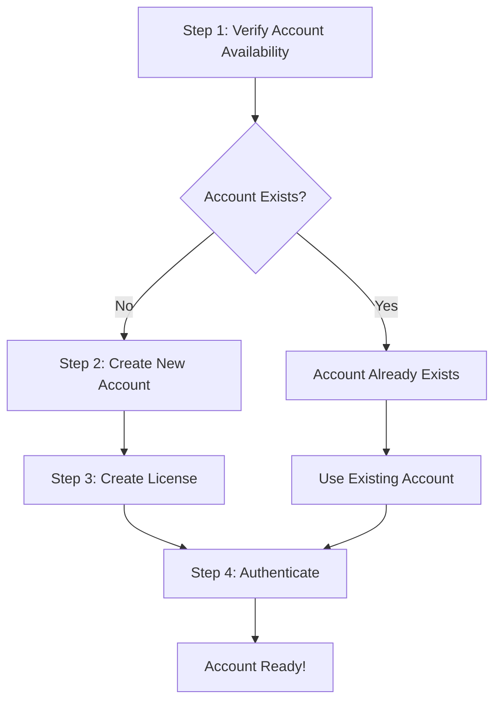

# How to Create a Zelf Account

Welcome to the complete guide for creating a Zelf account! This tutorial will walk you through the entire process of setting up your decentralized identity on the Zelf platform.

## What is Zelf?

Zelf is a **permissionless, decentralized platform** that enables you to create secure digital identities using cutting-edge biometric technology. Unlike traditional centralized systems, Zelf operates on a decentralized infrastructure where:

- **No central authority** controls your data
- **Your biometric data** is encrypted and stored securely
- **Zero-knowledge proofs** ensure privacy while maintaining security
- **IPFS storage** ensures your data is distributed and resilient

## Why We Need Your Information

You might wonder why we ask for detailed information like face biometrics, master passwords, and personal details. This is because Zelf operates on **permissionless technology** principles:

### 🔐 **Decentralized Security**
- **No central database** to hack or compromise
- **Biometric verification** ensures only you can access your account
- **Master password** provides an additional security layer
- **Zero-knowledge proofs** allow verification without revealing sensitive data

### 🌐 **Permissionless Architecture**
- **No gatekeepers** - anyone can create an account
- **No approval process** - the system validates automatically
- **No intermediaries** - direct peer-to-peer interactions
- **Censorship-resistant** - no single point of failure

### 🛡️ **Privacy by Design**
- **Face biometrics** are encrypted and never stored in plain text
- **Personal information** is stored on IPFS (distributed storage)
- **Zero-knowledge proofs** enable verification without data exposure
- **You control your data** - not a centralized entity

## The Complete Account Creation Flow

Creating a Zelf account involves a **4-step process** that ensures security, uniqueness, and proper setup:



Let's walk through each step:

---

## Step 1: Verify Account Availability

Before creating an account, we need to check if an account with your email or phone number already exists.

### Endpoint: `GET /api/clients`

**Purpose**: Check if an account already exists with your email or phone number.

**Why this step?**: In a permissionless system, we need to ensure account uniqueness without relying on a central database. This verification prevents duplicate accounts and ensures data integrity.

### Example Request

```bash
# Check by email
curl -X GET "https://api.zelf.world/api/clients?email=your.email@example.com" \
  -H "Content-Type: application/json"

# Check by phone
curl -X GET "https://api.zelf.world/api/clients?countryCode=%2B1&phone=5551234567" \
  -H "Content-Type: application/json"
```

### Expected Responses

**✅ Account Available (No existing account):**
```json
{
  "data": null
}
```

**❌ Account Already Exists:**
```json
{
  "data": {
    "id": "019983ff-99c0-78d0-ad25-0d7226626881",
    "publicData": {
      "accountEmail": "existing@example.com",
      "accountPhone": "5551234567",
      "accountCompany": "Existing Company",
      "accountType": "client_account"
    }
  }
}
```

**If an account exists**, you can proceed directly to [Step 4: Authentication](#step-4-authenticate-your-account).

---

## Step 2: Create Your Account

If no account exists, proceed to create a new one.

### Endpoint: `POST /api/clients`

**Purpose**: Create a new client account with biometric verification and master password.

**Required Information**:
- **Personal Details**: Name, email, phone, company
- **Biometric Data**: Face image (base64 encoded)
- **Security**: Master password for account encryption

### Example Request

```bash
curl -X POST "https://api.zelf.world/api/clients" \
  -H "Content-Type: application/json" \
  -d '{
    "name": "John Doe",
    "countryCode": "+1",
    "phone": "5551234567",
    "email": "john.doe@example.com",
    "language": "en",
    "company": "Example Corp",
    "faceBase64": "data:image/jpeg;base64,/9j/4AAQSkZJRgABAQAAAQ...",
    "masterPassword": "SecurePassword123!"
  }'
```

### What Happens During Account Creation?

1. **Biometric Processing**: Your face image is processed to create a unique biometric signature
2. **Encryption**: All sensitive data is encrypted using your master password
3. **IPFS Storage**: Account data is stored on IPFS (InterPlanetary File System)
4. **ZelfProof Generation**: A cryptographic proof is created for future authentication
5. **JWT Token**: You receive an authentication token for immediate use

### Success Response

```json
{
  "data": {
    "ipfsHash": "bafkreic6je22ypwrat7xlso7igw4gfvnkoyf7lhdztwu3hxojyrsi72v6e",
    "token": "eyJhbGciOiJIUzI1NiIsInR5cCI6IkpXVCJ9...",
    "zelfAccount": {
      "url": "https://blush-selective-earwig-920.mypinata.cloud/ipfs/...",
      "publicData": {
        "accountEmail": "john.doe@example.com",
        "accountPhone": "5551234567",
        "accountCompany": "Example Corp",
        "accountType": "client_account",
        "accountSubscriptionId": "free"
      }
    },
    "zelfProof": "AhfX5KHGyDdYzSeEs5AlNyxP+Nc1mUiAZD2hODPTnjvem7UI1baWW8ZoCrW10U4uG9ZcxT3EJgX5w6lPwdvMa4v+YZ/L4Hut54j4sMjCzLYEmNLSYkLEFUpsYB6MHnCIpbnP52Jr0khuDLK+3vIoll0doNRq+hJvo6VfOtwzqVNXe0tIxAs8yy8dfzRUg2DntRNSkrcEk2XNW2s6jG3wCDD5BHFL+DA5AaytZP0xl4DI572hf8KEM0YMBzQAfNeofeJTNeEfk1SjtGcf1Xj2abLk3ImCJ+VUm4h3G9fcL12b4qVIE+aqBnuTWJBmAU/9RzxNL2RPX4ZFppQ63JImnJqFR+Pyte24rCFDVir1qFI27Ny7zOvokxt/VwN9GfXuQwv1xTRiccjmqJywZavVzqBMTI6haL99IJK6HTkLLXVJ3ebKS0jXO6p5LLFSDPod/2zuNkVkUtrWupYVo5SL58DWpAHrImKiKrgJgpVgNt78SRbM4z9zOeD7lB2ugUek3lmUMXqoTL4A8Rz7gOzdVCKAzFf47lZ+X1lD7ldPtvxsagqKw/krpXHZ7AxuO3ARwbWY13SBTeSdyDR7NJ7WbebWhiTI07hRRLrEv+9i06eGd4tFaUg+UaLKJLHqLYsKqI8yKpvL5QnduKnLNOgiU1WYsvfw6it6TI41y3LpTaR/FczoucuTO9oUNN5Ktskjh6bSjJAKtT6Ttt2t5OLek0urUkoGtMwMDIhMof2C/IMV6JSJLX5yxjwj16WJtVvNxTW5L4iEIKXm6agYWt94ia3LP9V/AGmZuSGW0JOfpisHqzRN+alBFDu9k99juGWbSUEp42454vFvBM7ALl7yi9Gpv9k6sUJRUoS/QdLnm3AgKIpLBWvNJooofmQIbDCfutpdFphFbyHp6vkWkTC497urbZkH/NkEvuvtP+F9FgLI+5LFQzGIzqb4LS5SIQ1Zi9nrUXkzfgmeOXc9ht1DsgYetGFMfgzPG0nqs5LGuv9EBO9zBDDiBH7mlM/Y43hugl9/14o41iRpi5Efw3UQQmTd6qWp0yfAaXhIox0yFM3Gg74S1DtCf9C0i4SQuZzIEJS/YSJNDy8396z39uZP7Z2QBcmOdEszXE8Frw6w3dDrSJDExCZ8TZ3TZBkVae7MpgUaKGiL0ZcssYApixrxEYEj728YGuI0RXO0s/rc8yCnoeoU3rahqKjP5FlzvtJkTNXp262nDBFIOGJ+UmAIc1Ii7JE0gg=="
  }
}
```

---

## Step 3: Create Your License

After creating your account, you need to create a license for your domain. This license defines the rules and permissions for your Zelf identity.

### Endpoint: `POST /api/license`

**Purpose**: Create or update a license for a domain with comprehensive configuration settings.

**Why a License?**: In a permissionless system, licenses define the rules and boundaries for your digital identity. They specify:
- **Domain permissions** and validation rules
- **Feature access** and limitations
- **Payment settings** for services
- **Storage configuration** for your data

### Example Request

```bash
curl -X POST "https://api.zelf.world/api/license" \
  -H "Content-Type: application/json" \
  -H "Origin: https://yourdomain.com" \
  -H "Authorization: Bearer YOUR_JWT_TOKEN_HERE" \
  -d '{
    "domain": "mydomain",
    "faceBase64": "your_face_base64_data",
    "masterPassword": "your_master_password",
    "domainConfig": {
      "name": "mydomain",
      "holdSuffix": ".hold",
      "status": "active",
      "description": "My custom domain",
      "limits": {
        "tags": 1000,
        "zelfkeys": 5000
      },
      "features": [
        {
          "name": "Zelf Name System",
          "code": "zns",
          "description": "Encryptions, Decryptions, previews of ZelfProofs",
          "enabled": true
        }
      ],
      "validation": {
        "minLength": 3,
        "maxLength": 50,
        "allowedChars": {},
        "reserved": ["www", "api", "admin"],
        "customRules": []
      },
      "storage": {
        "keyPrefix": "mydomain",
        "ipfsEnabled": true,
        "arweaveEnabled": false,
        "walrusEnabled": false
      },
      "tagPaymentSettings": {
        "methods": ["coinbase", "crypto"],
        "currencies": ["BTC", "ETH"],
        "whitelist": {},
        "pricingTable": {
          "1": {
            "1": 240,
            "2": 432,
            "3": 612,
            "4": 768,
            "5": 900,
            "lifetime": 3600
          }
        }
      },
      "metadata": {
        "version": "1.0.0",
        "support": "standard"
      }
    }
  }'
```

### License Configuration Explained

**🔧 Domain Configuration**:
- **Name**: Display name for your domain
- **Status**: Active, inactive, or suspended
- **Description**: Human-readable description

**📊 Limits**:
- **Tags**: Maximum number of tags you can create
- **ZelfKeys**: Maximum number of ZelfKeys you can store

**✨ Features**:
- **ZNS**: Zelf Name System for decentralized naming
- **ZelfKeys**: Secure storage for passwords, notes, etc.

**🛡️ Validation Rules**:
- **Length limits**: Minimum and maximum domain name lengths
- **Reserved names**: Names that cannot be used
- **Custom rules**: Additional validation logic

**💾 Storage Settings**:
- **IPFS**: Primary decentralized storage
- **Arweave**: Permanent storage option
- **Walrus**: Additional storage layer

**💳 Payment Configuration**:
- **Methods**: Supported payment methods
- **Currencies**: Accepted cryptocurrencies
- **Pricing**: Cost structure for different services

---

## Step 4: Authenticate Your Account

Now that your account and license are set up, you can authenticate to access your Zelf services.

### Endpoint: `POST /api/clients/auth`

**Purpose**: Authenticate using your biometric data and master password to receive a JWT token.

**Authentication Methods**:
- **Email + Face + Password**
- **Phone + Face + Password**

### Example Request

```bash
curl -X POST "https://api.zelf.world/api/clients/auth" \
  -H "Origin: https://yourdomain.com" \
  -H "Content-Type: application/json" \
  -d '{
    "email": "john.doe@example.com",
    "faceBase64": "data:image/jpeg;base64,/9j/4AAQSkZJRgABAQAAAQ...",
    "masterPassword": "your_master_password",
    "identificationMethod": "email"
  }'
```

### Authentication Success Response

```json
{
  "data": {
    "token": "eyJhbGciOiJIUzI1NiIsInR5cCI6IkpXVCJ9...",
    "zelfProof": "ApAdnrOCquTDdOIuOTv9Q1X7LTFt6Hsso000dxWSzfu38zCpNZ4e7eEJhc8Y1kJPgBvj1pamMVKROPklz/lIO0HJFsH3uXA530VYWiRoiFVfxzWLBmDFuvbLtmemOJEaZ+PI6qsEJp9Efv9x5FHV3vRYDRv3EsIiJuPATyZMwQ367aMWnZZ4tcdSD9ShJskd9pECkdTvh/GoGZWWQvmabmxOjDn9eCF4zpRwj4/asLihWrXGQZV8mU3HNVOYxwjwEDPzG1gNb9qlnoW6PMDIkoW3Z9MusD7U2llmj0kd6hqh+kHL66fmEUPNEHh01Hf3d1evdsAt0wifFL+LN46i0nN23tv9OWPjzjfXy7zqsyBh6Oqu1A3+7CoEZyGKD0FFT5nGelPn3IK8voFkgEhUqGbTBh1gaEXq5F+Mn3LliIxyGQXTFlr6oQ+OpRdXmwx8xfATdUAJA6wKSmE38OD4+OzqpPFp3/Yo9EeOjY8G3G91pqVpqRmQd3/CZMN8z7Pq/hOKD3v/0RwqC1Wk9CAp1S2r80P4Lofbn30yPIcZBoU+7wVdFkfLIGnmv/M5fMdr0v0ubHLSGl60TFnhor5lN7rm0PpZmGfXBgxDssY/GMINWvIlckfK5yCt/+4GtEMbuHa9X8IiYqW4z+Kt4ab73aoVxSK8dtaHTG3BXT4/NF/DJbVTRQnBoEtSniZktysmvmFWxWFi3t5+HhQ5IOj0+GBy6Lzhl2bDkCfdtivVqlHXFjOpdrUY10hwU5++TXoTMeoWdCOSQ3iciHBfN78tOccGCa6oY3VHvH8s6qsTvZWYvC/f+7qIHvmRZdqmON6yGBlCvtU0XbcpC5huNMeMxi2dR5KrbFwlcjrK35pAHGgFymbLN0bHOxisNIhstlt2yYxTQyrlJ3ZKuVKfI8tPU+fs9naMoP8ZcdhRcW99w/tENXYh61GPMKu9Q2oARcB6CP9Qs+DQxMN3BU+xbGZIva7wHoRg+aIVOAqoD1W5572I2U8sYpeNgd6TTbDpttMb0C5wdCGuRtYnbfQgqEY+TaBJhGIr7rIJEATimr2oeGwUjzHsOF1YI5gMf1Bxcz9vsdrT2k+5X7JKTOFs0jr0pfakWlgowaUtFFhzVOKSrGY+0y3YYEKJ+tkXPvi2Hz6iB8jUxKZ3xLpkfk1Mm7F0qCRYmzmlhCouvDDTKFviXDM2agGnXCIFJ8llM4KgvXUUbK5omK5TxFcrxtFqjdLurbO9V+xAhg==",
    "zelfAccount": {
      "url": "https://blush-selective-earwig-920.mypinata.cloud/ipfs/...",
      "publicData": {
        "accountEmail": "john.doe@example.com",
        "accountPhone": "5551234567",
        "accountCompany": "Example Corp",
        "accountType": "client_account",
        "accountSubscriptionId": "free"
      }
    }
  }
}
```

---

## Complete Example: Full Account Creation Flow

Here's a complete example showing all four steps in sequence:

### JavaScript/Node.js Example

```javascript
const axios = require('axios');

async function createZelfAccount() {
  const baseURL = 'https://api.zelf.world';
  const accountData = {
    name: "John Doe",
    countryCode: "+1",
    phone: "5551234567",
    email: "john.doe@example.com",
    language: "en",
    company: "Example Corp",
    faceBase64: "data:image/jpeg;base64,/9j/4AAQSkZJRgABAQAAAQ...",
    masterPassword: "SecurePassword123!"
  };

  try {
    // Step 1: Verify account availability
    console.log("Step 1: Verifying account availability...");
    const verifyResponse = await axios.get(`${baseURL}/api/clients`, {
      params: { email: accountData.email }
    });

    if (verifyResponse.data.data) {
      console.log("Account already exists. Proceeding to authentication...");
      // Skip to Step 4
      return await authenticateAccount(accountData.email, accountData.faceBase64, accountData.masterPassword);
    }

    // Step 2: Create new account
    console.log("Step 2: Creating new account...");
    const createResponse = await axios.post(`${baseURL}/api/clients`, accountData);
    const { token, zelfAccount } = createResponse.data.data;
    console.log("Account created successfully!");

    // Step 3: Create license
    console.log("Step 3: Creating license...");
    const licenseData = {
      domain: "johndoe",
      faceBase64: accountData.faceBase64,
      masterPassword: accountData.masterPassword,
      domainConfig: {
        name: "johndoe",
        holdSuffix: ".hold",
        status: "active",
        description: "John Doe's personal domain",
        limits: {
          tags: 1000,
          zelfkeys: 5000
        },
        features: [
          {
            name: "Zelf Name System",
            code: "zns",
            description: "Encryptions, Decryptions, previews of ZelfProofs",
            enabled: true
          }
        ],
        validation: {
          minLength: 3,
          maxLength: 50,
          allowedChars: {},
          reserved: ["www", "api", "admin"],
          customRules: []
        },
        storage: {
          keyPrefix: "johndoe",
          ipfsEnabled: true,
          arweaveEnabled: false,
          walrusEnabled: false
        },
        tagPaymentSettings: {
          methods: ["coinbase", "crypto"],
          currencies: ["BTC", "ETH"],
          whitelist: {},
          pricingTable: {
            "1": {
              "1": 240,
              "2": 432,
              "3": 612,
              "4": 768,
              "5": 900,
              "lifetime": 3600
            }
          }
        },
        metadata: {
          version: "1.0.0",
          support: "standard"
        }
      }
    };

    const licenseResponse = await axios.post(`${baseURL}/api/license`, licenseData, {
      headers: {
        'Authorization': `Bearer ${token}`,
        'Origin': 'https://yourdomain.com'
      }
    });
    console.log("License created successfully!");

    // Step 4: Authenticate
    console.log("Step 4: Authenticating...");
    const authResponse = await authenticateAccount(accountData.email, accountData.faceBase64, accountData.masterPassword);
    
    console.log("🎉 Account setup complete! You're ready to use Zelf services.");
    return authResponse;

  } catch (error) {
    console.error("Error during account creation:", error.response?.data || error.message);
    throw error;
  }
}

async function authenticateAccount(email, faceBase64, masterPassword) {
  const authData = {
    email: email,
    faceBase64: faceBase64,
    masterPassword: masterPassword,
    identificationMethod: "email"
  };

  const response = await axios.post('https://api.zelf.world/api/clients/auth', authData, {
    headers: {
      'Origin': 'https://yourdomain.com',
      'Content-Type': 'application/json'
    }
  });

  console.log("Authentication successful!");
  return response.data.data;
}

// Run the complete flow
createZelfAccount()
  .then(result => {
    console.log("Final result:", result);
  })
  .catch(error => {
    console.error("Account creation failed:", error);
  });
```

---

## Security Best Practices

### 🔐 **Master Password**
- Use a **strong, unique password**
- Consider using a password manager
- **Never share** your master password
- Store it securely offline

### 📸 **Face Biometric Data**
- Use **high-quality images** with good lighting
- Ensure your **face is clearly visible**
- **No sunglasses or masks** during capture
- Use **consistent lighting** for future authentications

### 🌐 **Network Security**
- Always use **HTTPS** connections
- Verify you're on the **official Zelf domain**
- **Never send** sensitive data over unsecured networks

### 🔑 **Token Management**
- **Store JWT tokens securely**
- **Don't expose tokens** in client-side code
- **Refresh tokens** when they expire
- **Log out** when done with sessions

---

## Troubleshooting Common Issues

### ❌ **Account Already Exists**
**Problem**: You get an error that the account already exists.
**Solution**: Use the existing account and proceed directly to authentication.

### ❌ **Invalid Face Data**
**Problem**: Face biometric verification fails.
**Solution**: 
- Ensure good lighting
- Remove glasses/masks
- Use a clear, front-facing image
- Try a different image

### ❌ **Master Password Issues**
**Problem**: Authentication fails with password error.
**Solution**:
- Verify you're using the correct password
- Check for typos
- Ensure caps lock is off
- Try the password from account creation

### ❌ **Network Errors**
**Problem**: API requests fail or timeout.
**Solution**:
- Check your internet connection
- Verify the API endpoint is correct
- Try again after a few minutes
- Check for firewall restrictions

### ❌ **Validation Errors**
**Problem**: Request validation fails.
**Solution**:
- Ensure all required fields are provided
- Check email format is valid
- Verify phone number format
- Check country code format (+1, +44, etc.)

---

## What's Next?

Congratulations! You've successfully created your Zelf account. Here's what you can do next:

### 🏷️ **Create Tags**
- Use your license to create decentralized tags
- Set up custom domains and subdomains
- Configure payment methods for tag services

### 🔐 **Manage ZelfKeys**
- Store passwords securely
- Save encrypted notes
- Manage credit card information
- Create secure documents

### 🌐 **Explore ZNS Features**
- Set up decentralized naming
- Configure domain validation rules
- Manage storage settings
- Customize payment options

### 📱 **Integrate with Applications**
- Use the API to integrate Zelf into your apps
- Implement biometric authentication
- Add decentralized storage capabilities
- Enable privacy-preserving features

---

## Conclusion

You've successfully completed the Zelf account creation process! This tutorial has shown you how to:

1. ✅ **Verify account availability** using the decentralized verification system
2. ✅ **Create a new account** with biometric security and IPFS storage
3. ✅ **Set up a license** with comprehensive domain configuration
4. ✅ **Authenticate securely** using face biometrics and master password

Your Zelf account is now ready to use with all the benefits of **permissionless, decentralized technology**:

- 🔐 **Secure biometric authentication**
- 🌐 **Decentralized data storage**
- 🛡️ **Privacy-preserving zero-knowledge proofs**
- 💰 **Permissionless access to services**
- 🚫 **No central authority control**

Welcome to the future of decentralized identity! 🎉
